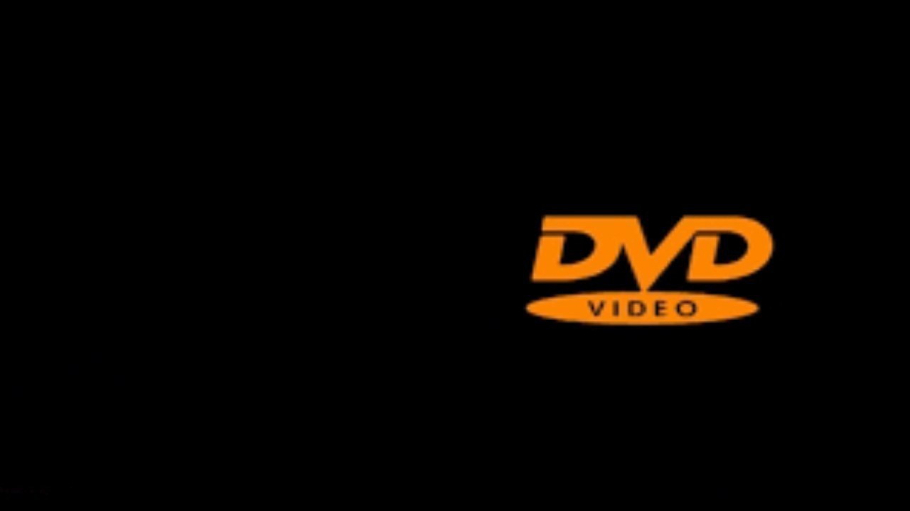

## 문제

DVD 로고는 (생김새는 그렇지 않지만) TV의 가로세로 변과 평행한 직사각형으로 나타낼 수 있다. 이 로고는 가로 속도 +1 또는 -1, 세로 속도 +1 또는 -1을 갖고 움직인다. 로고가 TV의 가로 변을 치면 세로 속도가 반전되고, 세로 변을 치면 가로 속도가 반전된다.

욱제는 DVD 로고가 TV의 꼭짓점을 치는 순간을 목격하는 사람에게 그 날의 행운이 찾아온다고 믿는다. 일반적인 TV에서 그 순간을 보는 것은 매우 드문 일이기 때문이다. 그러던 어느 날, 욱제는 기발한 생각을 했다. 꼭짓점을 치는 순간이 언제인지 알아낸 다음에 딱 그 순간에 달려가서 보면 되지 않을까?

DVD 로고가 TV 꼭짓점을 치려면 욱제가 최소 몇 초를 기다려야 하는지 욱제에게 알려 주자.

## 입력

첫 줄에 DVD 로고의 너비 w, 높이 h, TV의 너비 W, 높이 H가 주어진다. (1 ≤ w, h, W, H ≤ 106, w+2 ≤ W, h+2 ≤ H)

두 번째 줄에 DVD 로고의 왼쪽 위 꼭짓점의 초기 x좌표, y좌표가 주어진다. (0 < x < W-w, 0 < y < H-h) 왼쪽 위 꼭짓점의 좌표는 (0, 0)이다. 오른쪽으로 갈 수록 x좌표가 증가하고, 아래쪽으로 갈 수록 y좌표가 증가한다. ≤ 대신 <으로 범위가 정해진 것은 DVD 로고가 처음에 벽과 맞닿아 있지 않음을 의미한다.

세 번째 줄에 DVD 로고의 가로 속도(1 또는 -1)와 세로 속도(1 또는 -1)가 주어진다.

입력으로 들어오는 모든 수는 정수이다.

## 출력

DVD 로고가 TV 꼭짓점을 칠 때까지 기다려야 하는 최소 시간을 출력한다. 로고가 꼭짓점을 칠 수 없으면 -1을 출력한다.
