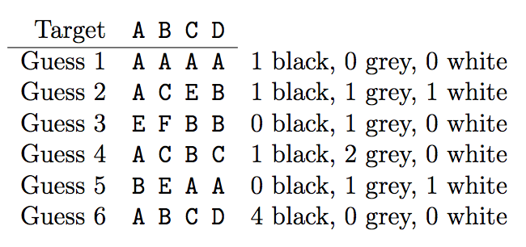

## 문제

Mastermind is a game played with a supply of pegs of various colours, or in the absence of proper equipment, pen and paper (or a computer!) using letters A, B, C, etc, as ‘pegs’ with the different letters representing different colours. One player chooses some particular arrangement of coloured pegs or letters and keeps it hidden. The other players attempts to guess the arrangement, guided by a score that the first player determines for each guess.

In ordinary Mastermind, the score is in two parts: a ‘black score’ counting the number of pegs that match the target peg in the same position, and a ‘white score’ that is the number of pegs that are not themselves ‘black’, but match the colour of an otherwise unmatched target peg in a different position from the guess peg.

Adjacent Mastermind adds a ‘grey score’ that is the number of pegs that do not match their corresponding target pegs but can be matched up with otherwise unmatched target pegs in the positions immediately to their left or right. (The leftmost and rightmost guess pegs of course only have one slot that is adjacent to them and that might make them grey.) The white score then becomes the number of pegs that are not themselves ‘black’ or ‘grey’, but match an otherwise unmatched target peg that is at least two positions away from the guess peg.

As in ordinary Mastermind, each target peg may only be matched by at most one guess peg, and each guess peg may only contribute to one of the scores at most once.

For example:

In guess 1, only the A in slot 1 contributes to the score, since only one peg may match the target A and this one is the best match. Similarly in guess 3 only the B in slot 3 scores, and similarly only one of the Cs in guess 4 scores. Finally in guess 5, only one of the As counts as white, because there is only one target A available.

Adjacent Mastermind is theoretically easier for the guessing player because more information is provided in response to each guess, but more difficult for the first player because the scoring is more complicated. Your task is to help the first player by calculating each guess’s score.

## 입력

Input consists of lines containing a target arrangement and a guess arrangement, separated by a single space. Each arrangement is a string of between 2 and 50 uppercase letters, ‘A’ to ‘Z’. On each line, the guess arrangement will be of the same length as its target.

A single ‘#’ on a line by itself indicates the end of input. This line should not be processed.

## 출력

Output will be one line for each target/guess input line, containing the guess and its score in the format ‘guess: b black, g grey, w white’.
