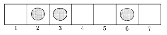

## 문제

1행 m열의 직사각형 체스판 위에서 진행하는 게임을 가정해 보자. 체스판의 각 칸에는 1부터 m까지 번호가 매겨져 있다. n개의 폰 (pawn)이 하나씩의 칸을 차지한 채로 체스판 위에 놓여 있으며, m번 칸은 비어 있다. 두 명의 플레이어가 게임을 한다. 각 플레이어는 자기 차례가 오면 i번 칸에 놓인 폰을 집어서 j번 칸으로 이동시킬 수 있다. 이때, j는 비어있는 칸의 번호 중 최솟값인데, 다만 i보다는 커야 한다. 게임의 승자는 마지막 칸인 m번 칸에 폰을 집어넣는 사람이다.

예를 들어, m=7인 그림의 상황에서 차례가 된 플레이어는 2번 칸의 폰을 4번 칸으로 옮길 수 있고, 3번 칸의 폰을 4번 칸으로 옮길 수도 있으며, 6번 칸의 폰을 7번 칸으로 옮겨 게임을 이길 수도 있다.

어떤 플레이어의 수가 ‘필승수'라고 하는 것은, 그 수를 둔 후엔 상대편이 어떤 수를 두더라도 반드시 이길 수 있는 경우를 말한다. 체스판의 현재 상황이 주어졌을 때, 이번에 차례를 맞은 플레이어가 둘 수 있는 필승수의 가짓수를 계산하는 프로그램을 작성하라.

## 입력

첫째 줄에 두 양의 정수 m과 n이 주어진다. (2 ≤ m ≤ 109, 1 ≤ n ≤ 106, n＜m) 둘째 줄에는 n개의 양의 정수가 오름차순으로 주어지는데, 이는 각각 현재 폰이 놓여 있는 칸의 번호를 나타낸다.

## 출력

첫째 줄에 이번에 차례를 맞은 플레이어가 둘 수 있는 필승수의 가짓수를 출력한다.
