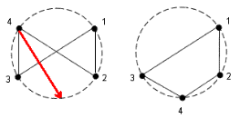
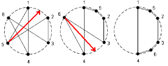

## 문제

하나의 큰 원에 1부터 N까지 숫자가 적힌 점이 시계방향으로 차례로 있다. 그리고 각 점은 서로 다른 두 점과 연결이 되어있다. (즉, 모든 점의 차수는 2라는 뜻이다.)

그런데 이 점을 연결하는 과정에서 연결하는 선이 서로 엉켜있다면 이것은 볼록다각형이 되지 못할 것이다. 그래서 원 위에 있는 점을 적절한 곳으로 옮겨서 선이 서로 엉키는 것을 푸려고 한다. 다음 그림을 보자.

처음에 왼쪽 그림과 같이 연결이 되어 있다고 하자. 그리고 4번 점을 빨간색 화살표와 같이 이동하면 오른쪽과 같이 될 것이다. 오른쪽 그림은 서로 엉킨 것이 없어 볼록다각형이 될 것이다.

위의 그림도 마찬가지로 가장 왼쪽에 있는 상태에서 위의 빨간색 화살표를 따라 두 번의 이동을 하면 가장 오른쪽과 같이 서로 엉키는 부분이 없어지게 된다.

1부터 N번까지의 점이 연결된 상태들의 정보가 주어져 있을 때, 엉킨 것을 모두 풀어서 볼록 N각형이 되게 하려면 최소한 몇 번의 점의 이동이 있어야 하는지 구하는 프로그램을 작성하여라.

## 입력

첫째 줄에 점들의 개수 N(1≤N≤500)이 주어진다. 그리고 두 번째 줄부터 N+1번째 줄까지 점들의 연결 상태가 주어진다. 각 정보는 두 개의 정수로 이루어 져 있는데 i번째 줄에 a와 b 두 정수가 주어져 있다면 i번 점과 a, b가 연결이 되어 있다는 것을 의미한다.

## 출력

첫 줄에 최소 이동 회수를 출력한다. 만약에 볼록 N각형을 만드는 것이 불가능 한 경우에는 -1을 출력한다.
