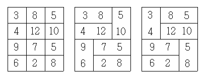

## 문제

N×3 크기의 2차원 배열에 수들이 적혀 있다. 이 배열에서 상하좌우로 인접한 두 칸을 하나로 묶되, 모든 칸들이 묶이도록 하려고 한다. 다음은 4×3 크기의 2차원 배열을 묶는 두 개의 예이다.

묶인 배열에 대해서 우리는 묶인 수들의 차를 생각할 수 있다. 첫 번째 경우 묶인 수들의 차의 총 합은 5+8+5+3+2+6=29로, 묶인 숫자의 차들의 합을 최대로 할 수 있는 방법이다. 두 번째 경우 묶인 숫들의 차의 총 합은 1+3+2+2+3+4=15이다. 이 방법은 묶인 숫자의 차들의 합을 최소로 할 수 있는 방법이다.

배열이 주어졌을 때, 묶인 수들의 차의 최대 합과 최소 합을 구하는 프로그램을 작성하시오.

## 입력

첫째 줄에 짝수 N(1 ≤ N ≤ 100,000)이 주어진다. 이어서 다음 N개 줄에는 배열에 적힌 수들이 한 줄에 세 개씩 빈 칸을 사이에 두고 주어진다. 배열에 적힌 수는 절댓값이 10,000을 넘지 않는 정수이다.

## 출력

첫째 줄에 최대 합, 둘째 줄에 최소 합을 출력한다.
