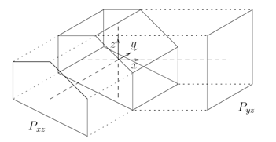

## 문제

3차원 공간에 입체도형이 있다. 이 입체도형은 볼록하며, xz평면과 yz평면에 수직으로 빛을 비췄을 때에 나오는 그림자가 볼록다각형 형태를 띤다. 즉, 입체도형의 두 평면에 대한 정사영이 볼록다각형이다. 예를 들어 밑의 그림과 같이 xz평면과 yz평면 위로의 정사영을 각각 Pxz, Pyz라 했을 때 각각이 볼록다각형임을 확인할 수 있다.

우리가 해야 할 일은 위와 같은 입체도형을 xz평면과 yz평면에 정사영시킨 형태가 주어졌을 때에 원본 입체도형을 복원해 그 부피를 구하는 것이다. 하지만 이 정보만으로 입체도형을 유일하게 복원할 수 없기 때문에 가능한 최대 부피를 구해야 한다.

## 입력

첫째 줄에 xz평면에 비친 정사영의 꼭짓점의 개수 Nxz (3 ≤ Nxz ≤ 1,000)가 주어진다. 그리고 두 번째 줄부터 Nxz+1번째 줄까지 Pxz의 꼭짓점의 좌표 x,z가 시계방향 순서로 공백을 사이에 두고 주어진다. 그리고 Nxz+2번째 줄에는 yz평면에 비친 정사영의 꼭짓점의 개수 Nyz (3 ≤ Nyz ≤ 1,000)가 주어지고 마찬가지로 Nxz+3번째 줄부터 Nxz+Nyz+2번째 줄까지 Pyz의 꼭짓점 좌표 y, z가 시계방향 순서로 공백을 사이에 두고 주어진다.

주어지는 모든 좌표는 절댓값이 500이하이다. 또한 입력되는 두 다각형은 볼록다각형임이 보장되며, 두 다각형의 최소, 최대 z 좌표는 각각 동일하다. 각 다각형의 입력에서 인접한 두 점은 항상 다르지만, 한 변 위에 있는 세 개 이상의 점이 입력될 수는 있다.

## 출력

첫째 줄에 원본 입체도형의 부피로 가능한 최댓값을 출력한다. 절대/상대 오차는 10-2까지 허용한다.
