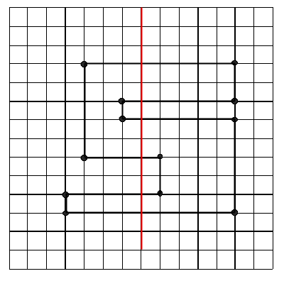

## 문제

색종이가 한 장 놓여 있고, 이 색종이를 가위로 잘랐을 때 몇 개의 조각으로 나뉘는지 알고 싶다. 이를 계산하는 프로그램을 작성하라.

## 입력

색종이는 다각형 모양으로, 평면에 놓여 있으며, 이를 가위로 자르는 경로는 x축 또는 y축에 평행한 하나의 직선이다. 첫째 줄에 이 직선이 지나는 두 점의 좌표값 (x1, y1), (x2, y2)가 주어진다. 둘째 줄에는 색종이의 꼭짓점 수가 주어진다. 셋째 줄부터 한 줄에 한 개씩 꼭짓점의 좌표 (x, y)가 주어진다.

각 좌표값은 빈칸으로 분리되어 있고 0이상 1,000,000 이하의 정수이다. 다각형의 꼭짓점은 반시계방향의 순서로 주어지고, 꼭짓점의 개수는 3이상 100,000 이하의 정수이다. 입력에 대해 오류 검사를 할 필요는 없다. 가위질을 한 후 생기는 다각형들은 모두 꼭짓점이 세 개 이상이다.

## 출력

첫 줄에 가위질로 인해 생기는 색종이의 조각 수를 출력한다.

## 힌트

