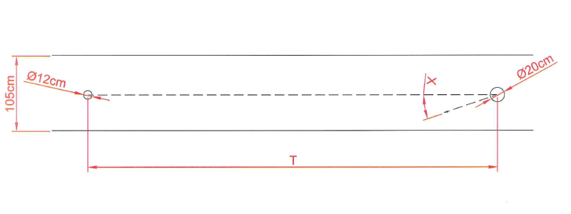

## 문제

상근이는 지름이 20cm인 볼링공을 폭이 105cm인 볼링 레인에 각도 X도로 레인의 중심에서 던졌다. (아래 그림을 참고)

레인은 범퍼가 장착되어 있어, 공이 범퍼에 닿으면, 입사각과 같은 각도로 튕기게 된다. 지름이 12cm 핀이 T 미터 떨어진 곳에 놓여져 있다. 상근이가 던진 볼링공이 이 핀을 맞출 수 있는지 없는지를 구하는 프로그램을 작성하시오.

## 입력

첫째 줄에 테스트 케이스의 개수 N이 주어진다. 다음 N개 줄에는 볼링공과 핀 사이의 거리 T (16.0 ≤ T ≤ 18.0)와 공을 던진 각도 X (중심을 기준으로 계산, 10 ≤ X ≤ 80)가 주어진다.

## 출력

각 테스트 케이스마다, 볼링공이 핀을 맞추면 "yes"를, 아니면 "no"를 출력한다.
