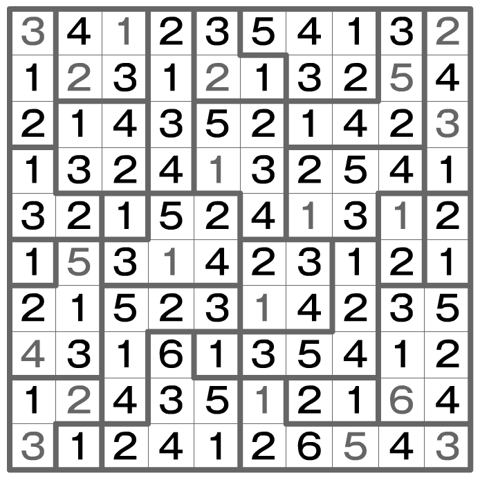

## 문제

파급효과가 가능한 퍼즐인지 판별하여라.

파급효과는 여러개의 폴리오미노로 구성된 직사각형의 그리드에서 발생한다. 폴리오미노는 하나 이상의 같은 크기의 정사각형을 이어붙여 만든 도형이다.

우리는 그리드 안의 모든 칸에 자연수를 배치해야한다. 이때 다음과 같은 규칙을 따르며, 일부 자연수는 미리 주어질 수 있다.

* 1 ~ (폴리노미오 안의 칸 수) 의 자연수들은 해당 폴리노미오 안에 반드시 한번씩만 배치되어야 한다.
* 하나의 줄이나 행에 동일한 숫자가 배치되기 위해선 두 숫자 사이에 해당 숫자만큼의 다른 칸이 존재해야 한다.  
  예를 들어, '1'이 배치된 칸은 서로 인접할 수 없으며, 다른 숫자가 쓰여진 칸이 두 '1' 사이에 하나 이상 존재해야 한다.  
  같은 줄이나 행에 '3'이 배치되기 위해선 다른 숫자가 쓰여진 칸이 사이에 세개 이상 존재해야 한다.

이 문제에서 폴리노미오의 크기는 최대 8이다.

## 입력

입력의 첫째 줄에는 테스트 케이스 T가 주어진다. (T<=100)

각각의 테스트 케이스의 첫째 줄에는 두 정수 R, C 가 주어진다. (4<=R, C<=15)

이후 R개 줄에는 그리드에 쓰여진 숫자들을 나태는 C개의 숫자 d\_i로 구성된 문자열이 입력된다. (1<=d\_i<=8)

이후 R개 줄에는 퍼즐의 각 칸이 폴리노미오로 연결된 방향을 나타내는 C개의 숫자가 입력된다. (이는 RxC 의 테이블이며, 이를 "descr" 라고 하자. 0<=descr(r,c)<=15)

descr(r,c)의 값은 이웃된 칸과의 연결 여부에 따라 다음과 같이 결정된다.

```

descr(r,c)=0
if(connected((r,c),(r-1,c)) descr(r,c)+=1; (UP)
if(connected((r,c),(r,c+1)) descr(r,c)+=2; (RIGHT)
if(connected((r,c),(r+1,c)) descr(r,c)+=4; (DOWN)
if(connected((r,c),(r,c-1)) descr(r,c)+=8; (LEFT)
```

예를 들어, 크기가 1인 폴리노미오의 칸은 주변의 어떠한 칸과도 이어져있지 않으므로 0의 값을 가지며, 위쪽의 칸과 아래의 칸에 이어져있는 칸들은 5의 값을 가지게 된다.

## 출력

각각의 테스트 케이스에 대해 한 "valid" 또는 "invalid" 를 출력하여라.
