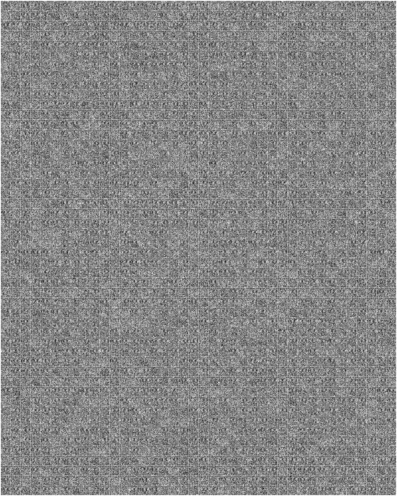

## 문제

간단한 퍼즐은 머리를 환기하기에 좋습니다, 그렇지 않나요?

Nonogram은 각 행과 열의 연속된 검은 사각형의 개수만이 순서대로 주어질 때, 이 단서로 그림을 그리는 것입니다. 아래 그림을 참고해 주세요.

|  |  |  |  |  |  |
| --- | --- | --- | --- | --- | --- |
|  |  | 2 | 4 | 1 | 1 |
|  | 2 |  |  |  |  |
| 1 | 1 |  |  |  |  |
|  | 2 |  |  |  |  |
|  | 2 |  |  |  |  |

그림 1: 완성되지 않은 Nonogram.

|  |  |  |  |  |  |
| --- | --- | --- | --- | --- | --- |
|  |  | 2 | 4 | 1 | 1 |
|  | 2 |  |  |  |  |
| 1 | 1 |  |  |  |  |
|  | 2 |  |  |  |  |
|  | 2 |  |  |  |  |

그림 2: 완성된 Nonogram.

우리가 Nonogram을 이용하여 그릴 그림은 QR 코드입니다. 노트에 있는 그림 3은 다음과 같은 형태의 QR 코드를 2,000개 포함하고 있습니다.

* QR 코드를 해독하면, 숫자열이 나옵니다. 이 숫자열을 9로 구분하면 총 2*n*개의 숫자열이 다시 나옵니다. 각 숫자열은 *n* by *n* Nonogram의 행과 열에 주어진 단서의 인코딩입니다. 단서는 행의 위에서부터 아래로, 그 다음 열의 왼쪽에서부터 오른쪽으로 순서대로 주어집니다. 각 숫자열의 인코딩 규칙은 다음과 같습니다.
  + 단서 0은 비어 있는 숫자열로 인코딩됩니다.
  + 이외의 경우, 단서에 있는 하나 또는 여러 개의 수는 다음과 같은 형식으로 인코딩되어 있습니다.
    - 주어진 수 *x*가 8 이하이면 *x*-1이 적힙니다.
    - 주어진 수 *x*가 8보다 크면, 8과 *x*-9가 순서대로 적힙니다.
  + 수들 사이에 별도의 구분자는 없으며, 단서의 수는 항상 16 이하입니다.
* 주어진 Nonogram을 풀어서 나온 결과는 QR 코드입니다. 이 QR 코드를 해독하면, 각 QR 코드의 데이터가 나옵니다.

각 QR 코드가 포함한 데이터는 다음 두 종류 중 하나입니다.

* 지시자 데이터. 항상 네 자리의 수입니다. 네 개의 숫자를 xxyy라고 했을 때, xx 부분은 행의 번호, yy 부분은 열의 번호에 해당하는 QR 코드를 가리킵니다. 이 QR 코드를 (xx, yy)로 표기하겠습니다. 즉, 예를 들어 (0, 0)은 가장 좌측 상단에 있는 QR 코드, (0, 1)은 그 QR 코드 오른쪽에 있는 QR 코드입니다. 행 번호와 열 번호는 0부터 시작합니다. 지시자 데이터를 만난 경우, 해당하는 QR 코드로 이동해서 QR 코드의 해독을 계속합니다.
* 플래그. 지시자 데이터 형식에 속하지 않으면 모두 플래그입니다. 이 문자열을 찾아서 제출하셔야 합니다.

당신의 할 일은 시작 위치의 QR 코드를 받아서 플래그를 찾아내는 것입니다.

이때, 플래그를 찾을 때 등장한 모든 지시자 데이터의 곱을 469,762,049로 나눈 나머지를 함께 출력하도록 합시다. 이 값을 checkprod라고 부르기로 합시다.

예를 들어, (1, 1) 위치에서 시작해서 (2, 2), (3, 3)을 따라서 플래그를 찾았을 경우, checkprod는 0202 \* 0303 = 61,206을 469,762,049로 나눈 나머지인 61,206입니다. (1, 1) 위치는 지시자 데이터로 알아낸 값이 아니라 처음에 주어진 값이었으므로 포함하지 않음에 주의하세요.

## 입력

서브태스크 번호가 입력됩니다.

## 출력

첫째 줄에 플래그를 출력합니다.

둘째 줄에 checkprod를 출력합니다.

## 힌트

그림 3: QR 코드의 목록.
