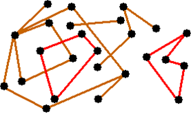

## 문제

정수 좌표로 이루어진 선분들의 정보를 입력받아 이 선분들의 좌표를 실제로 도화지에 그린다면, 이 그림은 모두 몇 개의 다각형으로 이루어져 있는지를 알려주는 프로그램을 작성하시오.

여기서 말하는 다각형이란 각 변이 세 개 이상의 직선으로 이루어진 단일폐도형을 말하며, 두 다각형이 겹치게 되면서 생기는 부분에 대한 도형은 다각형으로 인정하지 않는다. 즉, 입력된 좌표로 구성된 선분들만을 이용해서 만들어진 다각형만을 인정한다. 만약 다각형에 그 다각형을 이루지 않는 선분이 연결되어 있으면 다각형이 아니라고 판단한다.

예를 들어 입력으로 들어온 선분을 종이 위에 그려봤을 때, 위 그림과 같이 그려졌다면 2가지 다각형이 존재하는 것이고, 답으로 2를 출력하면 된다.

## 입력

첫째 줄에는 선분의 개수 N(1 ≤ N ≤ 60)이 들어온다. 다음에는 각 선분의 좌표가 N줄에 걸쳐서 입력으로 들어온다. 선분의 좌표는 "(한 쪽 끝점의 가로 좌표, 세로 좌표, 다른 쪽 끝점의 가로 좌표, 세로 좌표)"의 순서로 들어오며, 한 줄에 하나의 선분에 관한 정보가 들어온다. 좌표의 범위는 10,000 이하의 음이 아닌 정수이다.

## 출력

첫째 줄에 다각형의 개수를 출력하시오.
