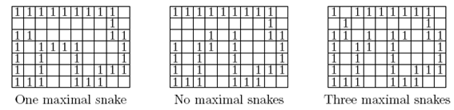

## 문제

0과 1로 차 있는 n×m 크기의 격자가 있다. 뱀은 1들의 연속이라고 볼 수 있다. 구체적으로 정의하자면 뱀은 이 격자 안에서 다음과 같은 조건을 만족하는 것이다.

1. 1이 들어 있는 칸을 뱀 격자라고 한다.
2. 뱀의 시작점과 끝점을 제외하고는 뱀 안에 있는 뱀 격자는 동서남북 방향으로 두 개의 뱀 격자와 만난다. 뱀의 양 끝점은 한 개의 뱀 격자와 만난다고 가정하여도 좋다.

그리고 maximal snake란, 위의 조건을 만족하는 뱀들 중, 뱀의 양 끝 중 한 군데에 1을 추가시킨다면 더 이상 위의 조건을 만족시키지 않는 뱀을 의미한다. 예를 들면 아래 그림에서 가장 왼쪽에 있는 곳에서는 하나의 maximal snake가 있고, 두 번째에는 maximal snake가 없으며 세 번째에는 세 개의 maximal snake가 있다.

n×m 격자가 주어져 있을 때, 몇 개의 maximal snake가 있는지 구하는 프로그램을 작성하시오.

## 입력

첫째 줄에 n, m(1 ≤ n, m ≤ 200) 이 주어진다. 그리고 n+1줄에 걸쳐 격자의 정보가 주어진다.

## 출력

첫째 줄에 maximal snake의 수를 출력하시오.
