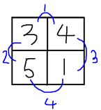

## 문제

N×M 크기의 격자에 적절히 수를 채우려 한다. 단, 인접한 수들의 차이로 1부터 (2NM-N-M)까지의 수가 한 번씩 나오도록 채우려 한다. N=2, M=2인 경우를 예로 들면 다음과 같은 방법이 있다.

위와 같이 채우면 인접한 수들의 차이로 1, 2, 3, 4가 모두 한 번씩 나오게 된다. N과 M이 주어질 때 위의 조건을 만족하며 수를 채우는 프로그램을 작성하시오.

## 입력

첫 줄에 정수 N과 M(1 ≤ N, M ≤ 1,000)이 주어진다.

## 출력

N개의 줄에 걸쳐 답을 출력한다. 답이 여러 가지가 있다면 그중 한 가지만 출력한다. 1 이상 2×109 이하의 정수만 채울 수 있다.
