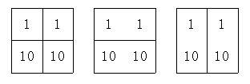

## 문제

N×M 배열에 수들이 쓰여 있다. 이 배열의 칸들을 인접(상하좌우)한 두 개의 칸으로 묶으려고 한다. 이때, 묶인 수들의 차이의 총 합이 최대가 되도록 하려 한다. 수들을 묶을 때 하나의 수는 오직 한 번만 묶여야 하며, 묶이지 않은 수도 물론 있을 수도 있다. 또, 수들을 묶을 때 그 차이가 T보다 큰 경우에는 묶을 수 없다.

예를 들어 왼쪽의 2×2 배열(T=9)을 두 가지 방법으로 묶을 수 있는데, 가운데와 같은 묶은 경우에는 묶인 수들의 차이의 총 합이 0(=|1-1| + |10-10|)이 되지만, 오른쪽은 18(=|1-10| + |1-10|)이 된다. 그리고 오른쪽의 방법이 최적해가 된다. 만일 T=8이라면, 오른쪽과 같이 묶을 수 없으므로, 최적해는 0이 된다.

주어진 배열에서 위의 조건을 만족하면서 수들을 묶을 때, 묶인 수들의 차이의 총 합을 최대로 하는 프로그램을 작성하시오.

## 입력

첫째 줄에 N, M(1 ≤ N, M ≤ 30), T(0 ≤ T ≤ 10,000,000)가 주어진다. 다음 N개의 줄에는 M개의 정수로 배열의 모양이 주어진다. 배열을 이루는 각각의 수는 절댓값이 1,000,000을 넘지 않는다.

## 출력

첫째 줄에 묶인 수들의 차이의 총 합을 출력한다.
