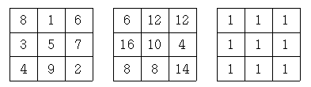

## 문제

3 by 3 크기의 마방진을 생각하자. 마방진이란 가로, 세로, 대각선 위의 수들의 합이 모두 같은 성질을 가지고 있다. 몇 가지 마방진을 예로 들면 다음과 같다.

생일빵을 맞은 정신을 잃은 동주와 세준이는 실수로 마방진에서 몇 개의 수를 지워 버리고야 말았다. 불쌍한 동주와 세준이를 도와, 마방진을 다시 완성해 보자. 마방진을 이루는 수들은 모두 20,000을 넘지 않는 자연수이다.

## 입력

첫째 줄부터 셋째 줄까지 마방진을 이루는 아홉 개의 수가 각 줄에 세 개씩 주어진다. 입력되는 수들 사이에는 빈 칸이 있으며, 지워진 수는 0으로 입력된다. 0의 개수는 3개 이하이다.

## 출력

완성된 마방진을 입력과 같은 형식으로 세 줄에 걸쳐 출력한다.
