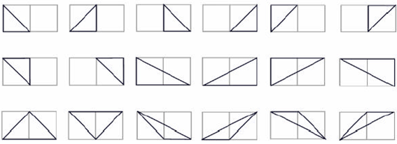

## 문제

삼각형이란 세 개의 변으로 이루어진 면적이 양수인 도형이다. 격자 삼각형이란 삼각형의 세 꼭짓점의 좌표가 정수로 표현되는 삼각형을 말한다. 격자의 범위가 N×M으로 주어질 때, 가능한 삼각형의 개수를 구하는 프로그램을 작성하시오. 예를 들어 N=1, M=2일 경우에는 다음과 같은 18개의 경우가 있다.

## 입력

첫째 줄에 두 정수 N, M이 주어진다.

## 출력

첫째 줄에 답을 출력한다.
