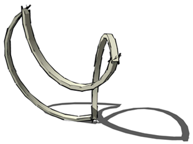

## 문제

N(1 ≤ N ≤ 20)개의 반원 모양의 철사들이 있다. 이들 중 몇 개를 택해서 붙였을 때, 하나의 연결된 모양(폐곡선)을 만들 수 있는지 알아내는 프로그램을 작성하시오. 두 개의 반원 모양의 철사는 그 끝을 임의의 각도로 붙일 수 있지만(즉, 각각의 반원을 얼마든지 회전할 수 있다), 중간에 다른 철사와 겹치는 부분이 있어서는 안 된다.

## 입력

첫째 줄에 데이터의 개수 K(1 ≤ K ≤ 30)가 주어진다. 각 데이터의 첫째 줄에는 N이 주어지고, 그 다음 줄에는 각 반원의 반지름을 나타내는 실수가 N개 주어진다. 각 실수는 10,000,000 이하의 양의 실수이고, 소숫점 아래 셋째 자리까지 입력될 수 있다.

## 출력

각 데이터에 대해서 가능한 경우에는 YES, 불가능한 경우에는 NO를 출력한다.
