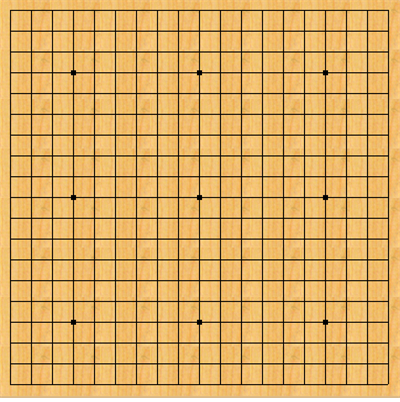
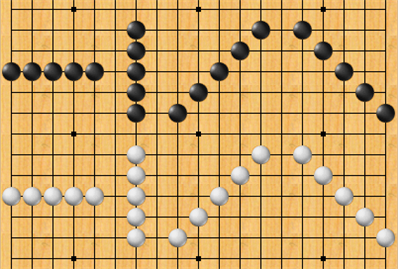
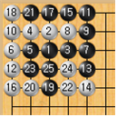
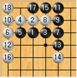
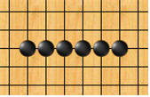

## 문제

19x19크기의 바둑판에, 돌을 놓을 좌표가 주어지면 이 게임이 몇 수만에 끝나는 지를 알아보려고 한다. 사용하고자 하는 바둑판의 모양은 위의 그림과 같으며, (1, 1)이 가장 왼쪽 위의 좌표이고 (19, 19)가 가장 오른쪽 아래의 좌표이다. 오목은 흑 또는 백이 5개의 돌을 가로, 세로, 혹은 대각선으로 연속으로 놓았을 경우 게임이 끝나게 된다. 즉, 다음 그림과 같은 경우를 말한다.

게임은 흑이 먼저 시작하며, 한수씩 서로 번갈아 가며 두게 된다. 다음 좌표들과 같이 차례로 돌을 놓으며 게임을 진행한다고 하자. (홀수번째는 흑, 짝수번째는 백)

* 1 - (3,3)
* 2 - (2,3)
* 3 - (3,4)
* 4 -  (2,2)
* 5 - (3,2)
* 6 - (3,1)
* 7 - (3,5)
* 8 - (2,4)
* 9 - (2,5)
* 10 - (2,1)
* 11 - (1,5)
* 12 - (4,1)
* 13 - (4,5)
* 14 - (5,5)
* 15 - (1,4)
* 16 - (5,1)
* 17 - (1,3)
* 18 - (1,1)
* 19 - (5,3)
* 20 - (5,2)
* 21 - (1,2)
* 22 - (5,4)
* 23 - (4,2)
* 24 - (4,4)
* 25 - (4,3)

위의 순서대로 바둑판에 돌을 놓으면 아래의 왼쪽 그림과 같이 된다.

그런데 생각해보면, 위의 좌표대로 돌을 놓았을 때 오른쪽 그림처럼 18번째의 돌을 놓는 것으로서 게임이 끝나 버리는 것을 알 수 있다. 이 경우, 답은 18이다.

바둑판에 돌을 놓는 좌표가 입력될 때, 몇 번째 수에서 오목이 끝나는지를 찾는 프로그램을 작성하시오. 오목을 두다 보면 다음과 같이 돌이 5개를 거치지 않고 6개 이상의 돌이 나란히 놓이는 경우가 발생할 수 있다. 이런 경우에는 승리를 인정하지 않고 오목이 계속된다는 것에 주의하라.

## 입력

첫째 줄에 바둑판에 놓이는 돌의 개수 N(1 ≤ N ≤ 100)이 주어진다. 그 다음 N줄에는 놓이는 돌의 좌표들이 차례로 주어진다. (홀수번째는 흑, 짝수번째는 백) 돌을 놓은 곳에 또 돌을 놓는 경우는 없다.

## 출력

첫째 줄에 몇 번째 수에서 승패가 갈리는지를 출력한다. 승패가 갈리지 않는 경우에는 -1을 출력한다.
