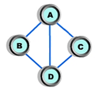

## 문제

방향성 없는 그래프에서 어떤 정점에 물려 있는 변의 수를 차수(degree)라고 한다. 예를 들어 아래 갈은 그래프에서 정점 A와 D의 차수는 3, B와 C의 차수는 2이다.

그래프가 주어졌을 때, 정점의 차수들을 정점 번호 순서대로 나열하면 하나의 수열을 얻을 수 있다. 이러한 수열을 차수열(degree sequence)라고 하는데, 위와 같은 그래프의 차수열은 3, 2, 2, 3이라고 할 수 있다. 임의의 그래프의 차수열이 주어졌을 때, 이러한 차수열을 갖는 그래프를 구하는 프로그램을 작성하시오. 그래프의 간선은 방향성이 없으며, 자기 자신으로 돌아오는 간선은 없어야 한다. 그래프가 반드시 연결되어 있을 필요는 없으나, 차수열이 정점 순서대로 반드시 대응되어야 한다.

## 입력

첫째 줄에 N(2 ≤ N ≤ 2,000)이 주어진다. 다음 줄에는 차수열을 이루는 N개의 정수가 빈칸을 사이에 두고 주어진다. 차수열의 정수는 N-1보다 작거나 같은 음 아닌 정수이다.

## 출력

첫째 줄부터 N개의 줄에 걸쳐 그래프의 인접 행렬을 출력한다. 인접 행렬은 0 또는 1로 이루어지며, 답이 여러 개인 경우는 그 중에 하나만 출력하면 된다. 그래프가 존재하지 않는 경우에는 첫째 줄에 -1만을 출력한다.
