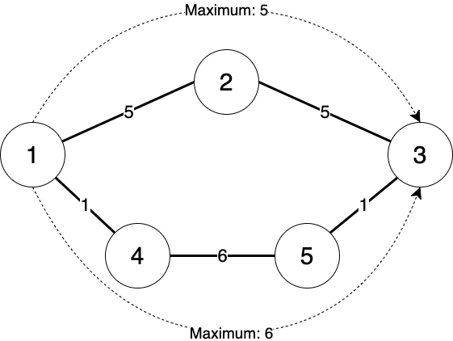

## 문제

소싯적 호석이는 골목 대장의 삶을 살았다. 호석이가 살던 마을은 *N* 개의 교차로와 *M* 개의 골목이 있었다. 교차로의 번호는 1번부터 *N*번까지로 표현한다. 골목은 서로 다른 두 교차로를 양방향으로 이어주며 임의의 두 교차로를 잇는 골목은 최대 한 개만 존재한다. 분신술을 쓰는 호석이는 모든 골목에 자신의 분신을 두었고, 골목마다 통과하는 사람에게 수금할 것이다. 수금하는 요금은 골목마다 다를 수 있다.

당신은 *A*번 교차로에서 *B*번 교차로까지 *C*원을 가지고 가려고 한다. 호석이의 횡포를 보며 짜증은 나지만, 분신술을 이겨낼 방법이 없어서 돈을 내고 가려고 한다. 하지만 이왕 지나갈 거면, 최소한의 수치심을 받고 싶다. 당신이 받는 수치심은 경로 상에서 가장 많이 낸 돈에 비례하기 때문에, 결국 갈 수 있는 다양한 방법들 중에서 최소한의 수치심을 받으려고 한다. 즉, 한 골목에서 내야 하는 최대 요금을 최소화하는 것이다.

예를 들어, 위의 그림과 같이 5개의 교차로와 5개의 골목이 있으며, 당신이 1번 교차로에서 3번 교차로로 가고 싶은 상황이라고 하자. 만약 10원을 들고 출발한다면 2가지 경로로 갈 수 있다. 1번 -> 2번 -> 3번 교차로로 이동하게 되면 총 10원이 필요하고 이 과정에서 최대 수금액을 5원이었고, 1번 -> 4번 -> 5번 -> 3번 교차로로 이동하게 되면 총 8원이 필요하며 최대 수금액은 6원이 된다. 최소한의 수치심을 얻는 경로는 최대 수금액이 5인 경로이다. 하지만 만약 8원밖에 없다면, 전자의 경로는 갈 수 없기 때문에 최대 수금액이 6원인 경로로 가야 하는 것이 최선이다.

당신은 앞선 예제를 통해서, 수치심을 줄이고 싶을 수록 같거나 더 많은 돈이 필요하고, 수치심을 더 받는 것을 감수하면 같거나 더 적은 돈이 필요하게 된다는 것을 알게 되었다. 마을의 지도와 골목마다 존재하는 호석이가 수금하는 금액을 안다면, 당신이 한 골목에서 내야하는 최대 요금의 최솟값을 계산하자. 만약 지금 가진 돈으로는 절대로 목표 지점을 갈 수 없다면 -1 을 출력하라.

## 입력

첫 줄에 교차로 개수 *N*, 골목 개수 *M,* 시작 교차로 번호 *A*, 도착 교차로 번호 *B*, 가진 돈 *C* 가 공백으로 구분되어 주어진다. 이어서 *M* 개의 줄에 걸쳐서 각 골목이 잇는 교차로 2개의 번호와, 골목의 수금액이 공백으로 구분되어 주어진다. 같은 교차로를 잇는 골목은 최대 한 번만 주어지며, 골목은 양방향이다.

## 출력

호석이가 지키고 있는 골목들을 통해서 시작 교차로에서 도착 교차로까지 *C* 원 이하로 가는 경로들 중에, 지나는 골목의 요금의 최댓값의 최솟값을 출력하라. 만약 갈 수 없다면 -1을 출력한다.
