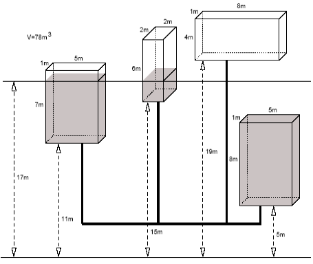

## 문제

N(1 ≤ N ≤ 50,000)개의 수조가 있다. 각각의 수조는 3차원 공간상에 존재한다. 수조에 대한 정보는 수조가 위치한 높이 b(0 ≤ b ≤ 1,000,000), 수조 자체의 높이 h(1 ≤ h ≤ 40,000), 수조의 가로길이 w(1 ≤ w ≤ 40,000), 수조의 세로길이 d(1 ≤ d ≤ 40,000)로 표현된다. 모든 수조의 아래에는 파이프가 달려 있고, 모든 파이프들은 하나로 연결되어 있다.

이러한 수조에 부피 V(1 ≤ V ≤ 2,000,000,000)만큼의 물을 넣으려고 한다. 수조들은 모두 파이프로 연결되어 있기 때문에, 전체 수조들의 제일 아래부터 차례로 물이 차게 된다. 문제의 편의를 위해서 파이프의 크기는 무시하기로 하자. 즉, 물은 파이프에는 들어가지 않고 수조에만 채워지는 것으로 간주한다. 이와 같이 물을 채웠을 때, 최종 수면의 높이를 구하려고 한다. 예를 들어 아래와 같은 경우에는 최종 수면의 높이 17이 된다.

수조들에 대한 정보와 물의 양이 주어졌을 때, 최종 수면의 높이를 구하는 프로그램을 작성하시오.

## 입력

첫째 줄에 정수 N이 주어진다. 다음 N개의 줄에는 각 수조의 b, h, w, d값이 주어진다. 제일 마지막 줄에는 물의 부피가 주어진다. 모든 입력은 정수이다.

## 출력

첫째 줄에 최종 수면의 높이를 소수점 아래 둘째 자리까지 출력한다. 절대 오차는 10-2까지 허용한다. 만약 물의 양이 많을 경우에는 OVERFLOW를 출력한다.
