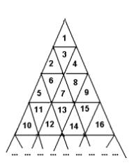

## 문제

위의 그림과 같은 삼각형이 있다. 작은 삼각형들은 1부터 시작해서 위와 같은 규칙으로 번호가 쭉 매겨져 있다. 이와 같은 그림에서, A가 적혀 있는 삼각형에서 B가 적혀 있는 삼각형으로 이동하려 한다.

한 삼각형에서 다른 삼각형으로 이동할 때에는 삼각형들의 변을 통해서만 움직일 수 있으며, 꼭짓점을 통해서는 다른 삼각형으로 이동할 수 없다. 또한 삼각형의 밖으로 이동할 수도 없다. 이와 같이 이동을 할 때, 도중에 지나는 변의 개수가 그 경로의 길이가 된다.

A와 B가 주어졌을 때, 가장 짧은 경로의 길이를 구하는 프로그램을 작성하시오.

## 입력

첫째 줄에 두 정수 A, B(1 ≤ A, B ≤ 1,000,000,000)가 주어진다.

## 출력

첫째 줄에 답을 출력한다.
