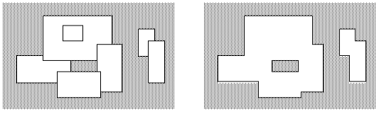

## 문제

2차원 평면상에 N(0 ≤ N ≤ 5,000)개의 직사각형들이 주어졌을 때, 이 직사각형들의 합집합을 구하는 프로그램을 작성하시오.

예를 들어 왼쪽은 7개의 직사각형이 주어진 모습이고, 오른쪽 그림은 그 직사각형의 합집합을 구한 예이다. 이러한 합집합을 구하면 하나의 다각형이 나오는데, 이 다각형의 둘레의 길이를 구하는 프로그램을 작성하시오.

## 입력

첫째 줄에 직사각형의 개수 N이 주어진다. 다음 N개의 줄에는 각 사각형의 정보를 나타내는 네 정수 x1, y1, x2, y2가 주어진다. 이는 사각형의 대각선으로 마주 보는 두 꼭짓점의 좌표가 (x1, y1), (x2, y2)라는 의미이다. 좌표의 범위는 -10,000이상 10,000이하이다.

## 출력

첫째 줄에 답을 출력한다.
