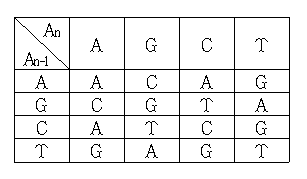

## 문제

N개의 A, G, C, T로 구성되어 있는 DNA 염기서열이 있다. 그리고 우리는 이 염기서열을 아래의 표를 이용하여 해독을 해야 한다.

해독 방법은 염기 서열에서 제일 끝에 있는 두 개의 염기를 An-1, An이라 할 때, An-1을 행으로 An을 열로 대응시켜 그에 해당하는 하나의 염기로 바꾸는 방식을 반복하는 것이다.  예를 들어 `AAGTCG`라는 염기서열이 있다고 하자. 이 서열을 위의 규칙 때로 해독하면 `AAGTCG` → `AAGTT` → `AAGT` → `AAA` → `AA` → `A` 가 되어 최종적으로 해독한 염기는 `A`가 된다.

문제는 어떤 염기서열이 주어졌을 때 위의 표를 참고하여 해독된 최종 염기를 출력하는 것이다.

## 입력

첫째 줄에 염기 서열의 길이 N(1 ≤ N ≤ 20,000,000)이 주어진다. 둘째 줄에는 염기서열을 나타내는 길이가 N인 문자열이 주어진다.

## 출력

첫째 줄에 최종 염기를 출력한다.
