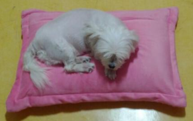

## 문제

베개와 가희가 방 안에 있습니다. 가희가 베개 위에서 자고 있는지 그렇지 않은지 출력해 주세요.

## 입력

첫 번째 줄에 방의 세로 길이 R, 가로 길이 C가 주어집니다.

두 번째 줄에 가희의 세로 길이 Rg, 가로 길이 Cg, 베게의 세로 길이 Rp, 가로 길이 Cp가 주어집니다.

세 번째 줄부터, R+2번째 줄까지, 길이가 C인 문자열이 주어집니다.

주어지는 문자열에 있는 문자는 가희를 나타내는 'G', 베게를 나타내는 'P', 빈 칸을 나타내는 '.' 중 하나입니다.

## 출력

가희가 베게 위에서 자고 있다면 1을, 그렇지 않으면 0을 출력합니다.

베개 중의 일부가 가희에 의해서 가려진 상태라면, 가희는 베게 위에서 자고 있습니다.
