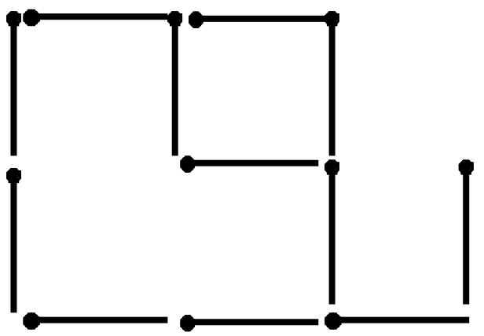

## 문제

테이블 위에 놓인 성냥개비를 생각해 보시오. 예시:

문제는 성냥개비들로 이루어지는 정사각형의 개수를 구하는 것이다. 예를 들어 위의 예시는 2개의 정사각형이 성냥개비로 이루어진다.

## 입력

입력은 여러 개의 배열로 이루어진다. 각 배열의 첫 번째 줄에는 열과 행의 수를 나타내는 두 개의 정수 r 과 c(1 ≤ r, c ≤ 20)가 주어진다. 그 뒤로는 성냥개비의 배열 상태를 나타내는 2r+1개의 줄이 주어진다. 배열을 나타내는 줄의 홀수 번째 줄은 c개의 문자로 이루어지며, 각각의 문자는 가로 방향으로 놓인 성냥개비를 나타내는 하이픈('–')과 빈 공간을 나타내는 별표('\*') 둘 중 하나이다. 배열을 나타내는 짝수 번째 줄은 c+1개의 문자로 이루어지며, 각각의 문자는 세로 방향으로 놓인 성냥개비를 나타내는 막대('|')와 빈 공간을 나타내는 별표('\*') 둘 중 하나이다. 0 0이 입력되면 입력이 종료된다.

## 출력

출력은 각 줄에 각 배열에서 이루어질 수 있는 정사각형의 수 뒤에 한 칸을 띄고 영어 단어 'squares'를 붙여 'X squares'와 같은 형식으로 출력해야 한다.
