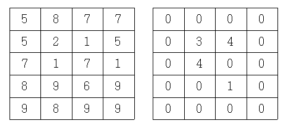

## 문제

N×M 크기의 물통이 있다. 이 물통의 각 칸은 높이가 다를 수도 있다. 이와 같은 물통에 물을 부었을 때, 담을 수 있는 물의 최대량을 계산하는 프로그램을 작성하시오. 물통의 테두리도 높이가 다를 수 있고, 테두리가 물통의 안쪽보다 높이가 낮을 수도 있다.

왼쪽 표는 물통의 높이를 나타낸 것이고, 오른쪽은 각 칸에 담은 물의 양을 나타낸 것이다. 이 경우가 답이 12로 최대인 경우가 된다.

## 입력

첫째 줄에 M, N(1 ≤ N, M ≤ 300)이 주어진다. 다음 N개의 줄에는 M개의 자연수로 각 칸의 높이가 주어진다. 각각의 높이는 1,000,000,000를 넘지 않는다.

## 출력

첫째 줄에 답을 출력한다. 답은 int 범위 이내이다. 이 값은 0이 될 수도 있다.
