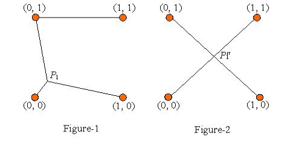

## 문제

[0, 1]×[0, 1]의 정사각형과 그 안(정사각형의 테두리 및 꼭짓점 포함)에 N개의 점들 P[1], P[2], …, P[N]이 있다. 이 점들과 정사각형의 네 꼭짓점을 연결하여 임의의 두 점이 직접 혹은 간접적으로 연결되어 있게 하려 한다. 이와 같이 만든 그래프의 간선의 길이를 합한 것을 Len(P) 라고 정의하자.

N개의 점들의 위치를 임의로 바꾸면 Len(P)의 값도 이에 따라 변하게 된다. Len(P)가 최소가 되도록 하는 점들의 집합을 P'라고 하자. 즉, Len을 점들의 집합 P에 대한 함수로 생각했을 때, Len의 최솟값이 Len(P')가 되는 것이다.

N개의 점들을 잘 배치하여 Len이 최소가 되도록 할 때, 각각의 점들을 이동시킨 거리가 최소가 되도록 하는 프로그램을 작성하시오.

즉, Len(P")=Len(P')를 만족하는 P"들 중에서, |P[1]-P"[1]| + |P[2]-P"[2]| + … + |P[N]-P"[N]|이 최소가 될 때, 그 최솟값을 구하는 것이다.

## 입력

입력은 여러 개의 테스트 케이스로 이루어져 있다. 각 테스트 케이스의 첫째 줄에 N(1 ≤ N ≤ 100)이 주어진다. 다음 N개의 줄에는 각 점의 x, y 좌표가 주어진다. 입력의 마지막 줄에는 0이 하나 주어진다. 좌표는 소숫점 여덟 자리까지 주어질 수 있다.

## 출력

각 테스트 케이스마다 답을 출력한다. 절대/상대 오차는 10-3까지 허용한다.

## 힌트

