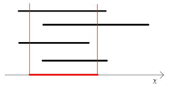

## 문제

수직선(數直線) 상에 구간 N개가 있다. 임의의 두 정수 A, B(A < B)를 정하여, 각 구간에서 A와 B 사이에 포함되지 않은 부분을 모두 잘라냈을 때 남는 부분들의 길이의 총합이 K가 되도록 하여라.

## 입력

1번째 줄에 정수 N, K(1 ≤ N ≤ 1,000, 1 ≤ K ≤ 1,000,000,000)가 주어진다.

2~N+1번째 줄에 각 구간의 왼쪽 끝점과 오른쪽 끝점의 위치가 주어진다. 양 끝점의 위치는 0 이상 1,000,000 이하의 정수이다.

## 출력

두 정수 A, B를 출력한다. 조건을 만족하는 A, B가 존재하지 않으면 “0 0”을 출력한다.

조건을 만족하는 A, B가 여러 개 존재할 때는 A가 가장 작은 경우를 출력한다. 그것도 여러 개 존재할 때는 B가 가장 작은 경우를 출력한다.
