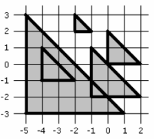

## 문제

평면상에 n개의 직각이등변삼각형들이 있을 때, 이 삼각형들이 덮는 면적을 구하는 프로그램을 작성하시오.

직각이등변삼각형은 세 정수 x, y, m(m>0)으로 표현된다. 이는 삼각형의 세 꼭짓점이 (x, y), (x+m, y), (x, y+m)임을 의미한다.

## 입력

첫째 줄에 정수 n(1 ≤ n ≤ 2,000)이 주어진다. 다음 n개의 줄에는 각 삼각형을 나타내는 x, y, m이 주어진다. x, y는 절댓값이 10,000,000을 넘지 않으며, m은 1,000이하이다.

## 출력

첫째 줄에 면적을 출력한다. 면적을 출력할 때는 소숫점 아래 한 자리를 반드시 출력한다.

## 힌트

