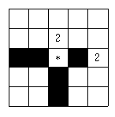

## 문제

한 도시에 지뢰가 묻혀 있다는 제보가 들어왔다. 당신은 도시를 테러의 위협에서 지키기 위해 지뢰를 제거하기로 하였다.

지뢰를 제거할 때에는 도시에 지뢰 제거용 폭탄을 매설하여 이를 터뜨리는 방법을 사용하기로 하였다. 도시에는 몇 개의 건물들도 있는데, 폭탄이 터질 때에 이 건물들을 건드려서는 안 된다. 반면에 도시에는 폭탄에 부서지지 않는 벽도 있어서 폭탄이 터지는 것을 막아 주기도 한다.

폭탄은 터지는 길이가 있는데, 그 길이만큼 위, 아래로 터지게 된다. 이때 중간에 부서지지 않는 벽이 있으면 더 이상 터지지 않고 그 위치에서 멈추게 된다.

위의 예는 \*의 위치에서 길이 2 짜리의 폭탄을 터뜨린 모양이다. 2는 폭탄에 부서지지 않는 벽이고, 검게 되어있는 부분은 폭탄이 터지는 부분이다. 물론 \*의 위치에서도 폭탄이 터진다.

도시의 모양이 주어졌을 때, 지뢰가 묻혀 있을 가능성이 있는 위치들을 모두 한 번 이상 폭파시키기 위해 필요한 폭탄의 개수를 구하는 프로그램을 작성하시오.

## 입력

첫째 줄에 두 자연수 N(1 ≤ N ≤ 100), M(1 ≤ M ≤ 100)이 주어진다. 이는 도시의 크기가 세로 N칸, 가로 M칸이라는 의미이다. 다음 줄에는 도시의 모양을 나타내는 정수가 주어진다. 0은 지뢰 및 폭탄이 설치될 수 있는 위치이고, 1은 건물(지뢰 및 폭탄 설치 불가능), 2는 폭탄에도 부서지지 않는 벽(지뢰 및 폭탄 설치 불가능)이다. 0, 1, 2 외의 정수는 입력으로 주어지지 않는다고 가정하자. 다음 줄에는 폭탄의 길이를 나타내는 자연수 K(0 ≤ K ≤ 100)가 주어진다.

## 출력

첫째 줄에 터뜨리는 폭탄의 개수 X를 출력한다. 다음 X개의 줄에는 폭탄을 터뜨린 위치를 출력한다. 위치를 출력할 때는 행 번호, 열 번호로 출력한다.
