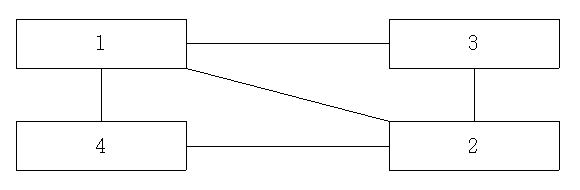

## 문제

정N각형의 각 꼭짓점에 1부터 N까지의 정수가 중복 없이, 그리고 임의의 순서로 붙어있다. 또 이 N각형의 내부에 M개의 대각선이 그려져 있다. 각각의 대각선은 교차하지 않는다고 하자(두 대각선의 한 끝점이 같은 경우는 교차하지 않는 것으로 간주한다).

이 다각형을 살펴보면서, N+M개의 선분들이 연결하는 두 꼭짓점에 붙어 있는 정수들의 목록을 나열하였다. 당신은 이 목록을 살펴보던 중, 다각형(과 대각선)이 있을 때 이와 같은 목록을 만드는 것도 쉬운 일이지만, 이와 같은 목록을 가지고 다각형(과 대각선)을 만드는 것도 그렇게 어렵지만은 않은 일임을 발견하였다.

예를 들어 이와 같은 목록이 (1, 3), (4, 2), (1, 2), (4, 1), (2, 3) 이었다고 했을 때, 다각형의 꼭짓점에 순서대로 1, 3, 2, 4의 정수를 붙이면 대각선도 교차하지 않고, 다각형의 모든 선분들이 목록에 있음을 알 수 있다.

선분들의 목록이 주어졌을 때, 이를 이용하여 다각형에 붙어 있는 정수를 구하는 프로그램을 작성하시오.

## 입력

첫째 줄에 정수 N(3 ≤ N ≤ 10,000), M(0 ≤ M ≤ N-3)이 주어진다. 다음 N+M 줄에는 각 선분의 두 끝점에 붙어 있는 정수가 주어진다.

## 출력

첫째 줄에 다각형에 붙어 있는 N개의 정수들을 출력한다. 1을 제일 먼저 출력하며, 두 번째 수가 더 작은 경우를 출력한다. (1 4 2 3 대신 1 3 2 4 를 출력)
