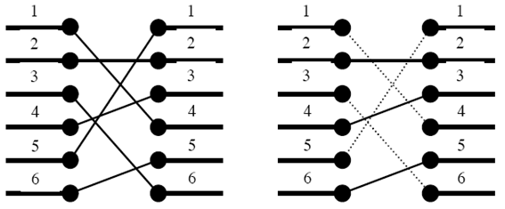

## 문제

반도체를 설계할 때 n개의 포트를 다른 n개의 포트와 연결해야 할 때가 있다.

예를 들어 왼쪽 그림이 n개의 포트와 다른 n개의 포트를 어떻게 연결해야 하는지를 나타낸다. 하지만 이와 같이 연결을 할 경우에는 연결선이 서로 꼬이기 때문에 이와 같이 연결할 수 없다. n개의 포트가 다른 n개의 포트와 어떻게 연결되어야 하는지가 주어졌을 때, 연결선이 서로 꼬이지(겹치지, 교차하지) 않도록 하면서 최대 몇 개까지 연결할 수 있는지를 알아내는 프로그램을 작성하시오

## 입력

첫째 줄에 정수 n(1 ≤ n ≤ 40,000)이 주어진다. 다음 줄에는 차례로 1번 포트와 연결되어야 하는 포트 번호, 2번 포트와 연결되어야 하는 포트 번호, …, n번 포트와 연결되어야 하는 포트 번호가 주어진다. 이 수들은 1 이상 n 이하이며 서로 같은 수는 없다고 가정하자.

## 출력

첫째 줄에 최대 연결 개수를 출력한다.
