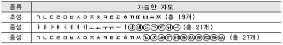
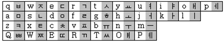

## 문제

컴퓨터를 이용하여 타자를 치다 보면 오타가 날 수 있다. 타자를 친 문장이 들어왔을 때, 이 문장에 오타가 있는지를 검사하고, 처음 오타가 난 부분을 알아내는 프로그램을 작성하시오.

## 입력

첫째 줄에 입력한 타자가 주어진다. 이는 2벌식 한글 키보드 자판에서 각 키에 해당하는 영문자로 주어진다.

## 출력

첫째 줄에 처음 오타가 난 위치를 출력한다. 오타가 없을 경우에는 0을 출력한다.
