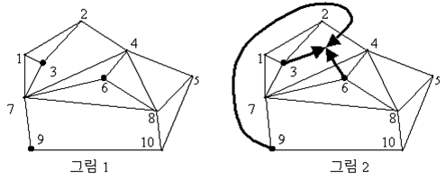

## 문제

어떤 나라에는 커다란 담장이 여러 개 건설되어, 한 담장의 양 끝은 정확히 두 마을과 연결이 돼 있다. 이 문제에서 마을은 점으로, 담장은 마을을 연결하는 선으로 표현된다. 담끼리 교차하는 경우는 없다. 그래서 이 나라는 담장 때문에 국토가 여러 "구역"으로 나눠지게 되는데, 한 구역에서 다른 구역으로 가려면 마을을 통과하거나 담을 넘어야 한다. 각 담장들은 모두 서로 이어져 있기 때문에 임의의 마을 A와 B에 대해서 한쪽 끝이 A이거나 B인 담장이 반드시 존재하며, 고립돼 있는 마을이 없다. 또한 담장만 따라 걸어가면 A에서 B까지 갈 수 있다.

이들 마을에 사는 사람들을 대상으로 하는 모임이 하나 있다. 각 마을마다 최대 한 명이 모임에 가입해 있으며, 모임에 가입한 사람이 한 명도 없는 마을도 있다. 그런데, 모임에 든 사람들이 마을 바깥에 있는 한 구역에서 만나고 싶어한다. 여기 회원들은 자전거를 타고 그 약속장소로 가는데, 교통 문제 때문에 마을을 통과하지 않으려 한다. 그리고 가는 과정에서 담장은 가능한 한 적게 넘고 싶다. 이들은, 도착하기 위해 각 회원들이 담장을 넘어야 하는 횟수의 합이 가장 적게 되는 곳을 찾아 거기서 모이기를 원한다.

마을은 1부터 N까지 번호가 매겨져 있다. (N은 마을의 총 개수) 그림 1을 보면, 정점은 마을을 나타내고, 정점들을 잇는 선은 담장을 나타낸다. 그리고 모임에 든 사람은 3번, 6번, 9번 마을에 한 사람씩 있다고 가정하자. 이때, 이 사람들이 전체적으로 담장을 가장 적게 거쳐서 모일 수 있는 적합한 곳은 그림 2에 나타나 있는 구역이다. 각 마을 사람이 화살표 친 대로 이동하면 되는 것이다. 담장을 넘은 총횟수는 2이다. 6번 사람이 4번과 7번 마을 사이에 있는 담을 넘어야 하고, 9번 사람이 2번과 4번 마을 사이에 있는 담을 넘었기 때문이다.

마을과 담장, 그리고 모임에 속한 사람들에 대한 자료를 입력받아, 모이기에 가장 적합한 구역을 고르고 담장을 넘는 총횟수의 최솟값을 구하는 프로그램을 작성하라.

## 입력

첫째 줄에는 구역의 개수 M이있다(2<=M<= 200). (그림 1을 살펴보면 생겨난 다각형 개수가 경계 바깥을 포함해서 10개임을 알 수 있다. 그 개수를 일컫는다.) 둘째 줄에는 마을(그림에서 꼭짓점)의 개수 N이있다(2<=N<= 250). 셋째 줄에는 모임에 든 회원의 수 L이 들어있다(1<=L<=30, L<=N). 그리고 넷째 줄에는 각 회원이 사는 마을의 번호를 나타내는 L개의 정수가 오름차순으로 들어있다.

그리고 다음에는 2M개의 줄이 있으며, 한 구역에 대한 정보가 두 줄에 걸쳐 들어있다. 거기서 첫줄에는 이 구역이 감싸는 마을의 개수 I가 들어있으며, 다음줄에는 이 구역의 경계를 이루는 마을 I개의 번호가 시계 방향 순서로 들어있다. 다만, 한 가지 예외가 있는데, 가장 마지막에 있는 구역은(M째 구역) 마을 전체의 바깥을 이루는 구역에 대한 정보이다. 이 구역을 다룰 때만은 가장 바깥을 감싸고 있는 마을들의 번호가 반시계 방향 순서로 제시된다. 이렇듯 입력 파일에는 담과 마을로 인해 생겨난 모든 구역에 대한 정보가 바깥쪽 구역까지 포함해서 모두 들어있다.

구역은 입력 파일에 수록돼 있는 순서가 곧 그 구역을 지정하는 번호가 된다. 가장 먼저 나오는 구역이 1번 구역, 그 다음에 있는 구역이 2번이다. 즉, 모이기에 가장 적합한 구역을 가리킬 때는 입력 파일에서 몇째로 나온 구역인지를 출력하면 된다.

## 출력

첫째 줄에는 답안 프로그램이 구한 총횟수의 최솟값을 출력한다. 둘째 줄에는 담장을 가장 적게 넘고 만날 수 있는 구역의 번호를 출력한다. 그런 구역이 여러 개 있을 수 있더라도 한 곳만 출력하면 된다.
