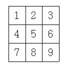
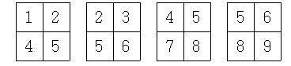

## 문제

N×M(1 ≤ N, M ≤ 256)의 행렬이 하나 있다. 이 행렬의 부분행렬들 중 그 성분(원)들의 합이 K(1 ≤ K ≤ 1,000,000)로 나누어떨어지는 경우가 몇 가지나 되는지 알아보려 한다.

부분행렬은 말 그대로 어떤 행렬에서 부분적으로 뽑아내는 행렬을 의미한다. 다음의 예를 보면 이해가 갈 것이다.

위와 같은 3×3행렬이 있을 때, 2×2인 부분행렬들은 다음과 같다.

1×1인 부분행렬을 총 9개가 있고, 3×3인 부분행렬은 자기 자신 한 개만 있다.

## 입력

첫째 줄에 세 개의 자연수 N, M, K가 주어진다. 다음 N개의 줄에는 각 줄에 M개씩 정수들이 주어진다. 각각은 행렬의 성분들이다. 각 성분은 1보다 크거나 같고, 50보다 작거나 같은 자연수이다.

## 출력

첫째 줄에 부분행렬의 개수를 출력한다.
