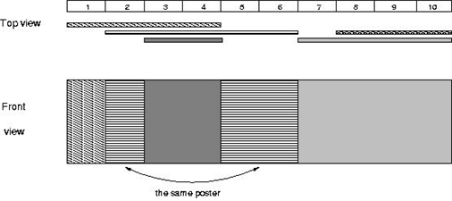

## 문제

마을에서 시장 선거를 하려 한다. 그래서 특정한 곳에 포스터를 붙이려 하는데, 선거 관리 위원회에서 몇 가지 규칙을 정해 주었다.

* 모든 후보자는 오직 한 개의 포스터만을 벽에 붙일 수 있다.
* 모든 포스터는 벽의 높이와 같게 하고, 포스터 너비는 자유다.
* 벽은 조각으로 나누어져 있으며, 하나의 조각의 단위는 byte다.
* 각각의 포스터는 정해진 벽 부분에 빈틈없이 붙어야 한다.

그리고 그들은 너비가 100,000,000byte의 벽을 마련해 주었다. 시장 후보 홍보가 시작됐을 때 각 후보자들은 벽에다가 그들의 포스터를 붙일 수 있다. 게다가 이미 붙이려는 부분에 포스터가 있어도 그 위에다 붙일 수 있다. 월드 마을사람들은 선거 전날 벽에 몇 명의 시장 포스터가 붙어 있는지 궁금하다. 당신의 할 일은 주어진 정보대로 포스터를 붙인 후에 선거 전날에 보이는 총 포스터의 수를 출력하는 프로그램을 작성하여라.

## 입력

첫줄에는 포스터의 개수 n(1 ≤ n ≤ 10,000)이 주어지고, 그 다음 n줄에는 각 포스터의 왼쪽 끝의 위치와 오른쪽 끝의 위치 l, r이 주어진다. (1 ≤ l < r ≤ 100,000,000)

## 출력

입력된 순서대로 포스터를 붙인 후에 보이는 포스터의 총 수를 출력하여라.
