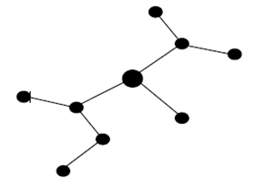

## 문제

n개의 정점으로 이루어진 트리가 있다. 이와 같은 트리를 DFS와 비슷한 방식으로 탐색하려 한다. 탐색을 시작할 때에는 트리의 한 정점에서 시작하여, 한 번도 지나지 않은 간선을 따라서 다음 정점으로 이동한다. 이때 한 번도 지나지 않은 간선이 여러 개 존재한다면 그 중 하나를 임의로 선택한다. 만약 한 번도 지나지 않은 간선이 존재하지 않는다면, 전 단계로 돌아간다. 이와 같은 과정을 반복하면 모든 간선을 두 번씩 지나게 된다.

이와 같은 탐색을 할 때, 시작 정점에서 멀어질 때 0을, 시작 정점에 가까워 질 때 1을 적으면 경로를 얻을 수 있다. 하지만 이와 같은 경로 저장 방식을 사용하면, 같은 트리라 하더라도 여러 개의 경로로 저장될 수 있다.

예를 들어 위와 같은 트리를 살펴보면, 0010011101001011, 0100011011001011, 0100101100100111 등의 경로로 탐색될 수 있다. 탐색 시작 정점은 그림에서 크게 표시된 정점이다.

트리를 탐색한 경로가 두 개 주어졌을 때, 이 경로들이 같은 트리를 탐색한 것인지 알아내는 프로그램을 작성하시오.

## 입력

첫째 줄에 데이터의 개수 T(1 ≤ T ≤ 10)이 주어진다. 다음 2×T개의 줄에는 트리를 탐색한 경로가 주어진다. 경로의 길이는 3,000을 넘지 않는다.

## 출력

입력 데이터 순서대로 T개의 줄에 출력을 하는데, 만약 같은 트리라면 1을, 다른 트리라면 0을 출력한다.
