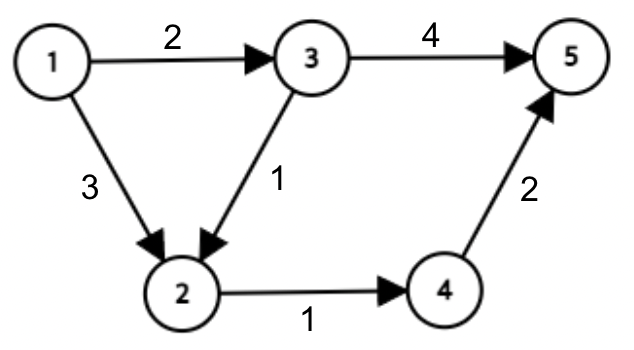

## 문제

선노가 사는 도시엔 \(1\)번부터 \(N\)번까지, 총 \(N\)개의 지하철 역이 있다. 이 지하철은 M개의 노선으로 이루어져 있고, 각각의 노선은 서로 다른 2개의 역을 편도로 운행한다.

선노는 \(x\)번 역에 살고 있고, 회사는 \(y\)번 역에 있다. 매일 최단경로로 출근을 하던 선노는 환승하는 것이 너무 귀찮아져서 회사에 최단거리로 출근하면서도, 동시에 가장 환승을 적게 하는 경로인 **최단최단경로**로 출근을 하려고 한다. 즉, **최단최단경로**는 최단경로이면서 동시에 가장 적은 개수의 노선을 사용하는 경로이다.

지하철 노선이 주어질 때, **최단최단경로**로 출근할 때의 이동 거리와 거치는 노선의 수, 그리고 서로 다른 **최단최단경로**의 개수를 구해보자.

## 입력

첫번째 줄에 \(N\), \(M\), \(x\), \(y\)가 공백으로 구분되어 주어진다.

두번째 줄부터 \(M\)개의 줄에 각 지하철 노선을 의미하는 \(u\), \(v\), \(w\)가 공백으로 구분되어 주어진다. 이는 \(u\)번 역부터에서 \(v\)번 역까지 이동하는 지하철 노선이 존재하며, 이 노선을 사용했을 때 이동 거리가 \(w\)임을 의미한다.

어떤 역에서 특정 역으로 향하는 노선이 여러 개일 수 있다. 이 때 해당 노선들은 모두 서로 다른 노선이다.

## 출력

\(x\)에서 \(y\)까지 갈 수 있는 경로가 없다면,

* 첫 번째 줄에 "`-1`"을 출력한다.

\(x\)에서 \(y\)까지 갈 수 있는 경로가 있다면,

* 첫 번째 줄에 \(x\)에서 \(y\)로 **최단최단경로**로 이동할 때의 이동 거리를 출력한다.
* 두 번째 줄에 \(x\)에서 \(y\)로 **최단최단경로**로 이동할 때 거치는 지하철 노선의 개수를 출력한다.
* 세 번째 줄에 \(x\)에서 \(y\)로 이동할 때의 서로 다른 **최단최단경로**의 개수를 109+9 로 나눈 나머지를 출력한다. 이동한 역의 순서가 동일하더라도 사용한 노선이 다르면 서로 다른 경로로 간주한다.

## 힌트

지하철 노선이 다음과 같고 선노가 사는 곳이 1번 역, 회사는 5번 역에 있다고 하면, **최단최단경로**로 이동할 때 이동 거리는 6, 거치는 노선 수는 2, 그런 경로의 개수는 1이다.

