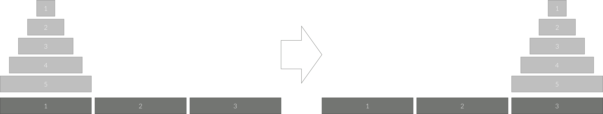

## 문제

세 개의 장대가 있고 첫 번째 장대에는 반경이 서로 다른 n개의 원판이 쌓여 있다. 각 원판은 반경이 큰 순서대로 쌓여있다. 이제 수도승들이 다음 규칙에 따라 첫 번째 장대에서 세 번째 장대로 옮기려 한다.

1. 한 번에 한 개의 원판만을 다른 탑으로 옮길 수 있다.
2. 쌓아 놓은 원판은 항상 위의 것이 아래의 것보다 작아야 한다.

이 작업을 수행하는 필요한 이동 순서 중에서 K번째를 출력하는 프로그램을 작성하라. 단, 이동 횟수는 최소가 되어야 한다.

아래 그림은 원판이 5개인 경우의 예시이다.

## 입력

첫째 줄에 첫 번째 장대에 쌓인 원판의 개수 N(1 ≤ N ≤ 60)과 K가 주어진다. 항상 K번째 이동이 존재하는 K만 주어진다.

## 출력

첫째 줄에 K번째 수행 과정을 의미하는 두 정수 A B를 빈칸을 사이에 두고 출력한다. 이는 A번째 탑의 가장 위에 있는 원판을 B번째 탑의 가장 위로 옮긴다는 뜻이다.
