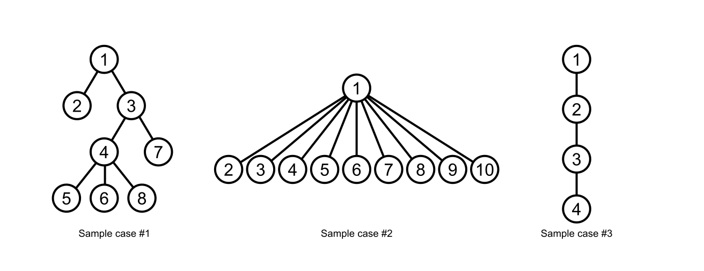
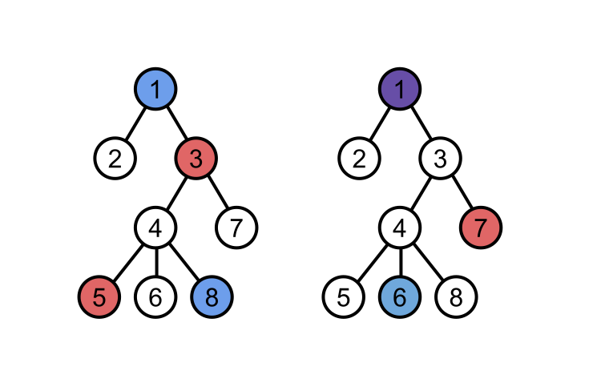

## 문제

Amadea and Bilva are decorating a rooted tree containing **N** nodes, labelled from 1 to **N**. Node 1 is the root of the tree, and all other nodes have a node with a numerically smaller label as their parent.

Amadea and Bilva's decorate the tree as follows:

* Amadea picks a node of the tree uniformly at random and paints it. Then, she travels up the tree painting every **A**-th node until she reaches the root.
* Bilva picks a node of the tree uniformly at random and paints it. Then, she travels up the tree painting every **B**-th node until she reaches the root.

The *beauty* of the tree is equal to the number of nodes painted *at least once* by either Amadea or Bilva. Note that even if they both paint a node, it only counts once.

What is the [expected](./001_Expected_value) beauty of the tree?

## 입력

The first line of the input gives the number of test cases, **T**. **T** test cases follow. Each test case begins with a line containing the three integers **N**, **A** and **B**. The second line contains **N**-1 integers. The i-th integer is the parent of node i+1.

## 출력

For each test case, output one line containing `Case #x: y`, where `x` is the test case number (starting from 1) and `y` is the expected beauty of the tree.

`y` will be considered correct if it is within an absolute or relative error of 10-6 of the correct answer.

## 힌트

The trees for each sample case are shown in the diagram below.

A few example colourings for sample case #1 are shown below.

* If Amadea picks node 5 and Bilva picks node 8, then together they paint 4 unique nodes: Amadea paints nodes 5 and 3, while Bilva paints nodes 8 and 1.
* If Amadea picks node 7 and Bilva picks node 6, then together they paint 3 unique nodes: Amadea paints nodes 7 and 1, while Bilva paints nodes 6 and 1 (note that Amadea painted node 1 as well).

