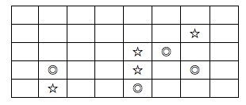

## 문제

N×M 모양의 맵에 아이템과 장애물이 있다. 이때 맵의 왼쪽 아래에서 출발하여 오른쪽 위로 가려고 하는데, 중간에 모든 아이템을 먹으려고 한다. 이동할 때에는 오른쪽이나 위쪽으로만 이동할 수 있다. 또, 장애물이 있는 곳으로는 지날 수 없다.

이때, 이동하는 경로의 개수가 총 몇 개인지 알아내는 프로그램을 작성하시오. 위의 예에서 ◎은 장애물, ☆는 아이템이다. 이때 경우의 수는 4 가지가 된다.

## 입력

첫째 줄에 N, M(1 ≤ N, M ≤ 100), A(1 ≤ A), B(0 ≤ B)가 주어진다. A는 아이템의 개수이고, B는 장애물의 개수이다. 다음 A개의 줄에는 아이템의 위치, B개의 줄에는 장애물의 위치가 주어진다. 위치를 나타낼 때에는 왼쪽 아래가 (1, 1)이 되고 오른쪽 위가 (N, M)이 된다.

## 출력

첫째 줄에 경우의 수를 출력한다. 이 값은 int 범위이다.
