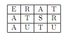
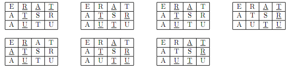

## 문제

다음과 같은 단어 격자가 있다.

여기서 TARTU란 단어를 읽는 방법은 총 7가지가 있다.

단어 격자와, 단어가 주어졌을 때, 주어진 단어를 읽을 수 있는 방법의 경우의 수를 구하는 프로그램을 작성하시오. 단어의 첫 글자는 격자의 어느 곳이 되어도 되고, 두 번째 글자부터는 그 전 글자가 있던 칸과 인접한 칸이어야 한다. (상하좌우, 대각선, 총 8방향). 각 칸은 중복되게 사용해도 된다.

## 입력

첫째 줄에 3개의 수 H, W, L이 주어진다. H는 격자의 높이, W는 격자의 격자의 너비, L은 단어의 길이이다. (1<=H,W<=200, 1<=L<=100) 다음 줄 부터 H개의 줄에는 격자에 있는 글자가 W개씩 주어지고, 마지막 줄에는 길이가 L인 단어가 주어진다. 모든 글자는 알파벳 대문자이다.

## 출력

단어를 읽을 수 있는 방법의 경우의 수를 출력한다. 이 값은 1018을 넘지 않는다.
