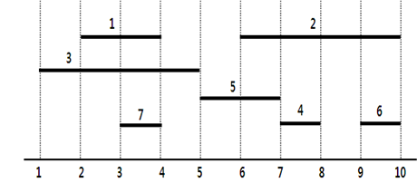

## 문제

1부터 N까지 번호가 붙여져 있는 N마리 서로 다른 동물이 있다. 모든 동물은 동일한 하나의 수평선 상에서 연속된 구간 내에서 활동한다. 이 구간을 그 동물의 활동영역이라 한다. 동물의 활동영역은 구간의 왼쪽 위치와 오른쪽 위치 쌍으로 나타낸다. 예를 들어, 7마리 동물의 활동영역이 다음 그림과 같다고 하자. 각 동물의 활동 영역은 선분으로 나타내어져 있다. 아래에서 동물 1의 활동영역은 (2, 4), 동물 2의 활동영역은 (6, 10), ..., 동물 7의 활동영역은 (3, 4)이다.

활동영역이 (x1, x2)인 동물 i와 (x3, x4)인 동물 j에 대하여, 다음 세 조건 중 하나를 만족하면 i가 j보다 먹이사슬에서 상위에 있다고 한다.

* **조건 1:** x1 < x3 이고 x2 > x4
* **조건 2**: x1 = x3 이고 x2 > x4
* **조건 3**: x1 < x3 이고 x2 = x4

동물들의 집단에 대하여 다음 조건을 만족하면서 모든 동물들을 나열 할 수 있으면, 이 집단은 먹이사슬 구조를 가진다고 말한다.

**조건**: 나열된 각 동물은 뒤에 나오는 모든 동물보다 먹이사슬에서 상위에 있다.

단, 하나의 동물로 이루어진 집단도 먹이사슬 구조를 가진다고 말한다. 먹이사슬 구조를 가지는 동물 집단의 크기는 이 집단에 속하는 동물의 수로 정의한다.

동물들의 활동영역이 주어질 때, 먹이사슬 구조를 가지는 동물 집단의 최대 크기를 구하는 프로그램을 작성하시오.

앞의 그림 예에서 먹이사슬 구조를 가지는 동물 집단의 예로 {1}, {2, 4}, {2, 6}, {1, 3}, {1, 3, 7}, ... 등이 있다. 집단 {1, 3, 7}에서  3은 1보다 상위이고 1은 7보다 상위로서 먹이사슬 구조를 가지는 최대 크기의 집단이다. 최대 크기 집단은 하나 이상일 수 있다.

## 입력

첫 번째 줄에는 동물의 수를 나타내는 N (1 ≤ N ≤ 500,000)이 주어진다. 다음 각 줄에 동물의 번호, 동물의 활동영역의 왼쪽 위치 L, 오른쪽 위치 R이 빈 칸을 사이에 두고 나온다. L, R은 1 이상 1,000,000,000 이하의 양의 정수이다.

## 출력

먹이사슬 구조를 가지는 최대 집단의 크기를 출력한다.
