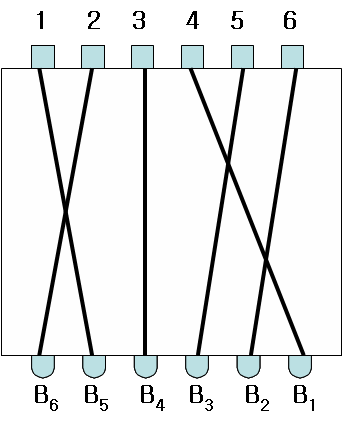

## 문제

아래 그림과 같이 박스 위쪽에 N개의 스위치, 아래쪽에는 그와 연결된 N개의 전구가 달린 스위칭 박스가 있다. 스위치는 왼쪽부터 1부터 N까지의 정수로 표시되고, 전구는 오른쪽부터 B1, B2, …, BN으로 표시된다.

각 스위치에는 하나의 전구만 연결되어 있고, 스위치를 누르면 연결된 전구에 불이 들어오게 된다. 예를 들어 4번 스위치를 누르면 B1에, 2번 스위치를 누르면 B6에 불이 들어온다.

두 개 이상의 스위치를 같이 누르는 경우, 전선이 서로 만나면 만난 전선에 연결된 전구들의 불은 켜지지 않는다.

예를 들어 위 그림에서 스위치 {2,3,4}를 누르면 전구 B6, B4, B1에 불이 들어오지만 스위치 {1,2}를 같이 누르거나 스위치 {4,5,6}을 같이 누르면 불이 켜지는 전구는 하나도 없다. 그리고 스위치 {1,2,3}을 같이 누르면 B4에만 불이 켜지게 된다. 이렇게 스위치를 조작해서 전구를 켤 때, 켜지는 전구의 값을 1로 표시한다면 전구가 켜진 상태는 N비트의 이진수로 볼 수 있다. 이 이진수를 해당 스위치 박스의 전구숫자라고 부른다.

어떤 스위치 박스의 연결구조가 주어지면 우리는 다양한 전구숫자를 만들어 낼 수 있다. 그러나 어떤 이진수는 전구숫자가 될 수 없다. 예를 들어 위의 그림에서 B6, B5 모두가 1인 전구숫자는 만들어 낼 수 없어 11로 시작하는 이진수는 불가능하다.

주어진 스위치 박스가 생성하는 모든 전구숫자 중에서 K번째의 수를 찾아내는 프로그램을 작성하시오.

앞의 그림에서 제시된 스위치 박스의 경우에 가능한 전구숫자를 오름차순으로 11개까지 나열하면 다음과 같다. 모든 스위치 박스에서 첫 번째인 전구숫자는 어떤 스위치도 누르지 않은 상태인 0000…0이다.

| 순서 | 스위치 | 전구숫자 |
| --- | --- | --- |
| 1 | {} | 000000 |
| 2 | {4} | 000001 |
| 3 | {6} | 000010 |
| 4 | {5} | 000100 |
| 5 | {5, 6} | 000110 |
| 6 | {3} | 001000 |
| 7 | {3, 4} | 001001 |
| 8 | {3, 6} | 001010 |
| 9 | {3, 5} | 001100 |
| 10 | {3, 5, 6} | 001110 |
| 11 | {1} | 010000 |

여러분은 입력으로 주어진 숫자 K에 대하여 오름차순으로 K번째 전구숫자를 찾아서 그 값을 십진수로 출력해야 한다. 예를 들어 위의 경우에서 K=6이라면 전구숫자 001000의 십진수 값인 8을 출력해야 한다.

## 입력

첫 번째 줄에는 스위치의 수(전구의 수)를 나타내는 양의 정수 N (3 ≤ N ≤ 30)이 나타나고 그 다음 줄에는 전구 BN, BN-1, …, B1에 연결된 스위치 번호들이 차례대로 빈칸을 사이에 두고 주어진다. 그리고 마지막 줄에 K(1 ≤ K ≤ 1,000,000,000)가 주어진다.

## 출력

첫 번째 줄에 해당되는 K번째 전구숫자의 십진수 값을 출력한다. 만일 K가 가능한 전구숫자의 개수보다 커서 해당되는 전구 숫자가 없을 경우에는 -1을 출력한다.
