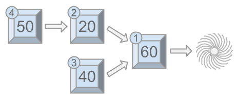

## 문제

Wile lives alone in the desert, so he entertains himself by building complicated machines that run on chain reactions. Each machine consists of $N$ modules indexed $1,2,\dots,N$. Each module may point at one other module with a lower index. If not, it points at the abyss.

Modules that are not pointed at by any others are called *initiators*. Wile can manually trigger initiators. When a module is triggered, it triggers the module it is pointing at (if any) which in turn may trigger a third module (if it points at one), and so on, until the chain would hit the abyss or an already triggered module. This is called a *chain reaction*.

Each of the $N$ modules has a fun factor $F\_i$. The fun Wile gets from a chain reaction is the largest fun factor of all modules that triggered in that chain reaction. Wile is going to trigger each initiator module once, in some order. The overall fun Wile gets from the session is the sum of the fun he gets from each chain reaction.

For example, suppose Wile has $4$ modules with fun factors $F\_1=60$, $F\_2=20$, $F\_3=40$, and $F\_4=50$ and module $1$ points at the abyss, modules $2$ and $3$ at module $1$, and module $4$ at module $2$. There are two initiators ($3$ and $4$) that Wile must trigger, in some order.

As seen above, if Wile manually triggers module $4$ first, modules $4$, $2$, and $1$ will get triggered in the same chain reaction, for a fun of $\max{(50,20,60)}=60$. Then, when Wile triggers module $3$, module $3$ will get triggered alone (module $1$ cannot get triggered again), for a fun of $40$, and an overall fun for the session of $60+40=100$.

However, if Wile manually triggers module $3$ first, modules $3$ and $1$ will get triggered in the same chain reaction, for a fun of $\max{(40,60)}=60$. Then, when Wile triggers module $4$, modules $4$ and $2$ will get triggered in the same chain reaction, for a fun of $\max{(50,20)}=50$, and an overall fun for the session of $60+50=110$.

Given the fun factors and the setup of the modules, compute the maximum fun Wile can get if he triggers the initiators in the best possible order.

## 입력

The first line of the input gives the number of test cases, $T$. $T$ test cases follow, each described using 3 lines. Each test case starts with a line with a single integer $N$, the number of modules Wile has. The second line contains $N$ integers $F\_1,F\_2,\dots,F\_N$ where $F\_i$ is the fun factor of the $i$-th module. The third line contains $N$ integers $P\_1,P\_2,\dots,P\_N$. If $P\_i=0$, that means module $i$ points at the abyss. Otherwise, module $i$ points at module $P\_i$.

## 출력

For each test case, output one line containing `Case #x: y`, where $x$ is the test case number (starting from 1) and $y$ is the maximum fun Wile can have by manually triggering the initiators in the best possible order.

## 힌트

Sample Case #1 is the one explained in the problem statement.

In Sample Case #2, there are $4$ initiators (modules $2$ through $5$), so there are $4$ chain reactions. Activating them in order $3$, $5$, $4$, $2$ yields chains of fun $3$, $5$, $4$, $2$ for an overall fun of $14$. Notice that we are summing the four highest fun numbers in the input, so there is no way to get more than that.

In Sample Case #3, an optimal activation order of the $5$ initiators is $4$, $5$, $7$, $6$, $8$.
