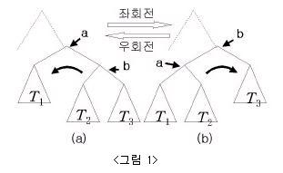
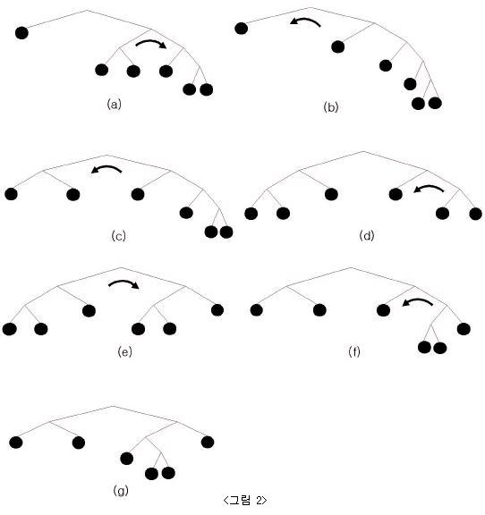

## 문제

0-2 이진트리(binary tree)는 다음과 같이 정의된다.

(1) 항상 루트노드(root node)가 지정되어 있다.

(2) 모든 내부노드(internal node)는 반드시 두 개의 자식노드(child node)를 가지며, 왼쪽 자식노드와 오른쪽 자식노드를 구분한다.

이러한 0-2 이진트리의 루트노드 혹은 루트노드의 오른쪽 자식노드에서 좌회전 연산과 우회전 연산 은 아래 <그림 1>과 같이 표현된다.

<그림 1-(a)> 이진트리의 노드 'a'에서 좌회전 연산은

(1) 노드 'a'의 자리에 노드 'b'를 위치하게 하고,

(2) 노드 'a'를 노드 'b'의 왼쪽 자식노드로 만들며,

(3) 노드 'b'의 왼쪽 부트리(subtree) T2를 노드 'a'의 오른쪽 부트리로 만든다.

<그림 1-(a)> 트리의 노드 'a'에 좌회전 연산을 적용하면 <그림 1-(b)> 이진트리로 변환된다.

이와 유사하게 우회전 연산을 정의할 수 있다. 위 <그림 1-(b)> 이진트리의 노드 'b'에서 우회전 연 산은

(1) 노드 'b'의 자리에 노드 'a'를 위치하게 하고,

(2) 노드 'b'를 노드 'a'의 오른쪽 자식노드로 만들며,

(3) 노드 'a'의 오른쪽 부트리 T2를 노드 'b'의 왼쪽 부트리로 만든다.

<그림 1-(b)> 트리의 노드 'b'에 우회전 연산을 적용하면 <그림 1-(a)> 이진트리로 변환된다.

같은 개수의 노드를 가지는 두 개의 0-2 이진트리가 있을 때, 이 두 이진트리의 회전거리는 한 트리 의 루트노드 혹은 루트노드의 오른쪽 자식노드에 좌회전 혹은 우회전 연산을 적용하여 다른 트리로 만 드는 회전연산의 최소 회수를 나타낸다.

예를 들면, 다음 쪽의 <그림 2-(a)> 트리를 <그림 2-(g)> 트리로 변환하기 위해서는 <그림 2>에서 와 같이 6번의 좌/우회전 연산을 적용하면 된다. 또한 6번 이하 회수의 회전 연산을 사용하여서는 변환 할 수 없으므로, 두 트리 사이의 회전거리는 6이다.

두 개의 0-2 이진트리가 주어졌을 때, 두 트리 사이의 회전거리를 계산하는 프로그램을 작성하시오.

## 입력

첫 번째 줄에는 입력되는 두 트리의 노드 개수를 나타내는 정수 N(5≤N≤300)이 주어지며, 각 노드는 1번 부터 N번까지 번호가 부여된다.

두 번째 줄부터 다음 N개의 줄에는 첫 번째 트리의 구조를 나타내는 데이터가 입력된다. 각 줄에는 세 개의 정수가 주어지는데, 두 번째, 세 번째 정수가 나타내는 노드들은 각각 첫 번째 정수가 나타내는 노드의 왼쪽, 오른쪽 자식임을 나타낸다. 첫 번째 정수가 나타내는 노드가 단말 노드(terminal node)인 경우에는, 두 번째, 세 번째 정수는 모두 0이다. 루트노드의 번호는 항상 1번으로 주어지며, 각 줄은 첫 번째 정수가 1부터 N까지 증가하는 순으로 입력된다.

다음 N개의 줄에는 두 번째 트리의 구조를 나타내는 데이터가 첫 번째 트리의 구조를 나타내는 데이 터와 같은 형식으로 입력된다.

## 출력

첫 번째 줄에 입력되는 두 트리의 회전거리를 나타내는 정수 M을 출력한다. 다음 M개의 줄에는 첫 번째 트리를 두 번째 트리로 변환하는 회전연산에 관한 정보를 회전하는 순서대로 출력한다.

회전정보는 두 개의 문자로 표시한다. 첫 번째 문자는 회전하는 노드를 나타내며, 루트노드에서 회전 하는 경우에는 'T'로, 루트노드의 오른쪽 자식노드에서 회전하는 경우에는 'C'로 표시한다. 두 번째 문 자는 회전하는 방향을 나타내며, 좌회전 연산은 'L'로, 우회전 연산은 'R'로 표시한다.두 문자 사이에는 공백이 없다.

같은 회전거리를 가지는 회전변환 방법이 여러 가지인 경우는 그 중에서 한 가지 경우만을 출력한다. 입력되는 두 트리가 회전연산을 적용하여 서로 변환될 수 없는 경우에는 첫 번째 줄에 -1을 출력한다.
