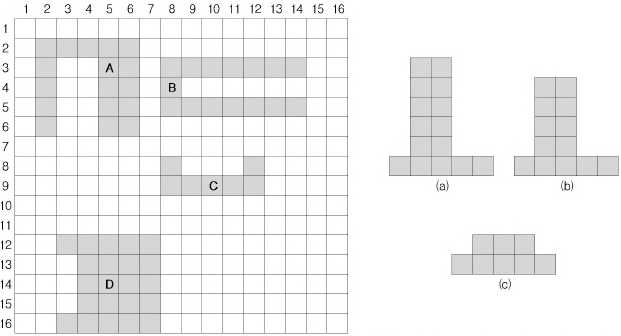

## 문제

아래 그림과 같이 정사각형 모양의 판에 'ㄷ'자 모양의 블록들이 여러 개 꽂혀 있다. 이때, 'ㅗ'자 모양의 블록이 1개 주어지면 이 블록을 판에 꽂혀 있는 'ㄷ'자 블록의 오목한 부분에 끼워 넣어 그 모양이 직사각형을 이루는가를 알아내려고 한다.

'ㄷ'자 모양의 블록이란 직사각형 블록에서 작은 직사각형만큼을 뺀 것으로 이때 작은 직사각형의 변은 원래 직사각형의 변 하나와만 겹친다.

예를 들어, 'ㅗ'자 모양의 블록 (a)가 주어지면, 이는 'ㄷ'자 모양의 블록 A, B, C, D 중의 어느 블록에 맞추어도 직사각형을 만들 수 없으나, 블록 (b)를 블록 A에 끼우면 직사각형이 된다. 블록 (c)는 블록 C와 D모두에 맞는 블록이다.

'ㄷ'자 모양의 블록들이 들어 있는 판과 'ㅗ'자 모양의 블록이 1개 주어지면, 이 블록이 끼워져서 직사각형이 될 수 있는 'ㄷ'자 블록들을 구하는 프로그램을 작성하시오.

<주의사항>

1. 정사각형은 직사각형의 일종이다.
2. 'ㅗ'자 모양의 블록을 회전시킬수 있지만, 뒤집을 수는 없다.
3. 'ㅗ'자 모양의 블록을 끼워서 만들어지는 직사각형이 이미 있던 'ㄷ'자 모양의 블록과 겹치면 안 된다.
4. 'ㅗ'자 모양의 블록을 끼워서 만들어지는 직사각형이 판 바깥으로 나가면 안 된다.

## 입력

첫째 줄은 판의 한 변의 길이가 입력된다. 판의 한 변의 길이는 50이하이다. 둘째 줄에는 오른쪽 그림과 같이 'ㅗ'자 모양의 블록을 나타내는 양의 정수 u, v, w, x, y가 차례로 입력된다. 셋째 줄부터는 판이 입력된다. 'ㄷ'자 모양의 블록이 꽂혀 있는 자리는 1, 블록이 꽂혀 있지 않은 자리는 0으로 표시된다.

주어지는 판에 있는 모든 블록은 'ㄷ'자 모양 블록이며 'ㄷ'자 모양 블록들은 서로 인접해있지 않다.

## 출력

출력의 첫째 줄은 'ㅗ'자 모양의 블록을 끼워서 직사각형이 될 수 있는 'ㄷ'자 모양 블록의 개수를 출력한다. 둘째 줄부터는 'ㅗ'자 모양의 블록을 끼워서 직사각형이 될 수 있는 'ㄷ'자 모양 블록의 왼쪽 위 구석의 위치를 한 줄에 하나씩 출력한다. 구석의 위치는 판의 윗변에서 떨어진 거리와 판의 왼쪽 변에서 떨어진 거리로 나타낸다. 구석의 위치를 나타내는 두 수 사이에는 빈 칸을 하나 둔다. 출력해야 하는 위치가 여러 개인 경우에 출력하는 순서는 임의로 한다.

'ㅗ'자 모양의 블록을 끼워서 직사각형이 될 수 있는 'ㄷ'자 모양의 블록이 없는 경우는 0만 출력한다.
