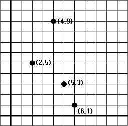
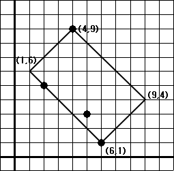

## 문제

여러 그루의 사과나무가 들판에 서 있다. 이들을 포함하는 가장 작은 면적의 직사각형 울타리를 치려고 한다. 이를 결정하는 프로그램을 작성하시오. 사과나무의 위치는 평면상의 좌표로 주어지는데 좌표 값은 모두 정수이다. 구하려는 울타리의 네 꼭짓점도 모두 정수 좌표를 가져야 한다.

이 경우 구하려는 울타리의 모양은 아래 그림과 같다.

## 입력

첫째 줄에는 사과나무의 수를 나타내는 정수 n이 주어진다. 그 다음 n개의 줄에는 사과나무의 위치를 나타내는 x좌표와 y좌표가 주어진다. n은 1,000이하의 양의 정수이고 x,y좌표는 -20,000이상, 20,000이하의 정수이다.

## 출력

직사각형 울타리의 네 꼭짓점을 나타내는 네 개의 좌표를 한 줄에 하나씩 출력한다. 네 꼭짓점은 임의의 한 꼭짓점에서 시작하여 시계 방향 순서로 출력되어야 한다.
