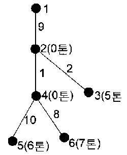

## 문제

어떤 도시의 한 운송 회사에서 그 도시에 살고 있는 손님들의 짐을 모아오려고 한다. 그 도시의 도로는 트리 형태여서 한 지점에서 다른 지점으로 가는 경로가 한가지 밖에 없다. 이 운송 회사는 최대 10톤까지 실을 수 있는 화물차 한 대를 사용하여 모든 손님들의 짐을 수거하려고 한다. 각 손님들의 짐은 임의의 정수인 무게로 나누어 실을 수 있고, 운송회사는 항상 지점 1에 있다고 가정한다.

이 운송 회사의 목표는 모든 손님들의 짐을 다 모아오기 위하여 운행된 화물차의 총 운행거리를 되도록 짧게 하는 것이다. 예를 들어서 다음과 같은 도로를 생각해 보자. 지점 1은 운송 회사가 있는 곳이고 지점들 2, 3, 4, 5, 6은 손님들이 있는 장소이다. 각 지점들을 연결하고 있는 선 옆의 수는 두 지점간의 거리를 나타내며 각 손님들이 있는 지점 옆 괄호 안의 수는 손님이 갖고 있는 짐의 무게이다.

이 경우, 화물차가 운송회사가 있는 곳인 지점 1에서 출발하여 지점 2와 4를 거쳐 지점 5에서 짐 6톤을 싣고, 지점 4와 2를 거쳐 지점 3의 짐 5톤 중 4톤을 실은 다음, 지점 2를 거쳐서 지점 1로 돌아와서 짐을 내린다. 다시 화물차는 지점 1에서 출발하여 지점 2와 4를 거쳐 지점 6에서 7톤을 싣고 지점 4와 2를 거쳐 지점 3에서 남은 짐 1톤을 싣고 지점 2를 거쳐 지점 1로 돌아오도록 경로를 정할 수 있다. 이때 화물차가 운행한 총 거리는 44 + 40 = 84 이다.

도시의 도로 상에 있는 n개의 지점에서 손님들의 짐의 무게와 그 지점들 간의 (n-1)개의 거리들이 주어질 경우, 손님들의 모든 짐을 수거하여 회사로 돌아오기 위하여 화물차의 총 운행거리를 되도록 짧게 하는 수거 방법을 찾는 프로그램을 작성하시오.

## 입력

첫 줄에는 지점들의 개수 n(n≤50)이 주어진다. 다음 줄부터는 지점 2에 있는 짐의 무게, 지점 3에 있는 짐의 무게, ..., 지점 n에 있는 짐의 무게가 한 줄에 하나씩 주어진다.

그 다음에는 인접한 지점들의 쌍과 그 길이가 한 줄에 하나씩 모두 (n-1)줄이 주어진다.

이때, 짐의 무게와 지점들 간의 거리는 모두 정수로 주어진다.

n

w2

w3

...

wn

I1 j1 d1

i2 j2 d2

...

in-1 jn-1 dn-1

## 출력

첫째 줄에 총 주행거리 D를 출력한다.

그 다음 줄부터는 짐을 실은 순서대로 지점과 무게를 출력하고 지점 1에 돌아왔을 때는 1을 출력한다.

D

i1.1  w1.1

...

I1.k1  w1.k1

1

i2.k2  w2.k2

...

1

...

1

ih.1  wh.1

...

ih.kh  wh.kh

1
